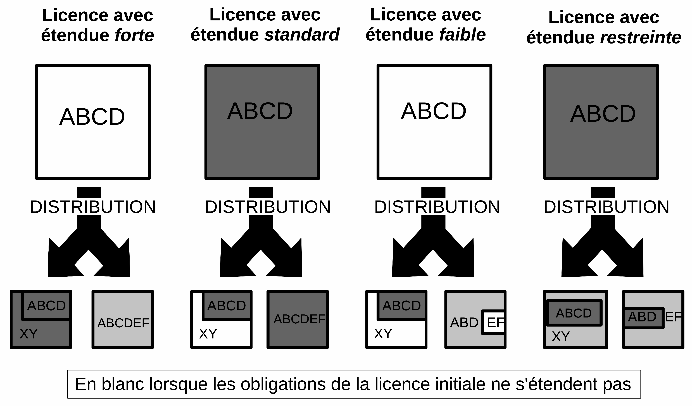

# Les bons repères pour s'orienter parmi les licences libres

La description des différents mouvements et usages qui entourent les licences libres laisse entrevoir une certaine complexité néanmoins facile à relativiser grâce à quelques _bons repères_ simplifiant la compréhension des différentes licences libres.

Le nombre de licences libres a plus que décuplé en une décennie. Cette multiplication s'explique essentiellement par le succès du Libre et par sa structure décentralisée. En dépit de l'autorité de certains organismes (notamment l'OSI et la FSF, mais aussi la Commission européenne ou les centres de recherche à leurs niveaux respectifs) plusieurs facteurs favorisent cet accroissement&nbsp;:

   - un facteur _personne_ lié à l'arrivée de nouveaux acteurs&nbsp;: en premier lieu l'industrie et ses atteintes particulières en termes de sécurité juridique et, en second lieu, les administrations et leurs contraintes particulières[^partdeuxchapdeux1])&nbsp;;
   - un facteur _temps_&nbsp;: les licences étant basées sur un système en constante évolution, elles évoluent ou se créent pour ajuster leurs effets&nbsp;;
   - un facteur _lieu_&nbsp;: certaines législations peuvent imposer des contraintes absentes dans d'autres régions. Toutes les combiner dans une seule licence peut s'avérer très difficile, voire impossible[^partdeuxchapdeux2]&nbsp;;
   - et enfin, un facteur _périmétrique_ lié à l'extension du Libre à d'autres domaines, pour lesquels des problématiques différentes peuvent induire la rédaction de nouvelles licences.

Le mouvement connaît cependant actuellement un succès et une professionnalisation qui induisent une structuration du cadre juridique basé sur les licences. L'OSI définit par exemple une hiérarchie entre les licences alors qu'une initiative comme le [projet Harmony](http://www.harmonyagreements.org) rédige des _Copyright Assignment_ «&nbsp;standards&nbsp;».

Trois éléments sont donc nécessaires pour pouvoir se repérer au sein de la «&nbsp;jungle&nbsp;» des licences libres&nbsp;: une qualification juridique des licences (2.1), une classification des licences (2.2) et un déchiffrement au moyen d'une grille de lecture dédiée aux licences (2.3).

<!-- NOTES -->

[^partdeuxchapdeux1]: En France il y a notamment un contrôle de légalité qui impose aux collectivités une prévisibilité dans leurs actes, ce qui peut inciter à utiliser des licences plus adaptées à cette nécessité. Un autre très bon exemple est la Commission européenne qui a rédigé sa propre licence&nbsp;: l'_European Union Public License_.

[^partdeuxchapdeux2]: Notamment si la contrainte réside en l'imposition d'une langue au détriment d'une autre (comme c'est le cas en France vis-à-vis de certaines personnes publiques).

<!-- /NOTES -->

## Qualifier juridiquement les licences libres

Un contrat exprime la volonté des parties et tient lieu de _loi des parties_ dès lors qu'il ne porte pas atteinte aux bonnes mœurs ou à l'ordre public[^partdeuxchapdeux3].

<!-- NOTES -->

[^partdeuxchapdeux3]: En l'occurrence, le seul argument juridique opposable à cette extension des droits serait l'abus de droit (cf. _supra_).Tout au plus pouvons-nous rappeler la décision du Conseil constitutionnel 2002-465 DC du 13 janvier 2003&nbsp;: «&nbsp;Le législateur ne saurait, sans méconnaître les exigences résultant des articles 4 et 16 de la Déclaration des droits de l'homme et du citoyen de 1789, porter au contrat légalement conclu une atteinte qui ne soit justifiée par un motif d'intérêt général satisfaisant&nbsp;» (l'article 4 est le fondement de la liberté contractuelle, l'article 16 est le fondement du principe de la sécurité juridique). L'effet n'étant ici qu'_inter partes_, il semble devoir être considéré comme valide.

<!-- /NOTES -->

### Un engagement juridique

Il convient d'analyser le type d'engagement juridique (2.1.1.1), l'impact des éléments liés au caractère international des licences (2.1.1.2) ainsi que la validité des exclusions de garantie et de responsabilité (2.1.1.3).

#### Le type d'engagement juridique

En l'absence de contestation sur les droits et devoirs de chacun, tout se passe généralement pour le mieux. En cas de discorde, le conciliateur, le juge ou l'arbitre, chercheront à déterminer la relation (exprimée ou non) qui lie les parties et à en retirer la dimension juridique afin de leur imposer les effets attendus. La qualification juridique de l'engagement est donc un passage obligé, mais encore faut-il rappeler aux juristes qui se pencheront sur cette question (juges, avocats, juristes d'entreprise, etc.) que cet exercice ne peut être mené sans intégrer le contexte particulier (communautaire et décentralisé, collaboratifs et évolutif, etc.) qui caractérise le Libre&nbsp;: une simple application des règles juridiques traditionnelles aboutissant à des réponses soit inadaptées soit contraires à la volonté des parties (voir à l'intérêt général).

Ce sont en l'occurrence les licences libres qui représentent l'essentiel de l'engagement, exprimant en termes de droits et d'obligations les engagements souscrits par chacune des parties dans le cadre du développement collaboratif d'une création (et reprenant très souvent les engagements souscrits préalablement par l'une d'elles). Ainsi, si l'auteur, ou ses héritiers, décide(nt) de revenir sur ce qu'il a pu promettre aux détenteurs d'une copie de l'œuvre ou créateurs d'œuvres dérivées, ou si l'un de ces détenteurs en déduit des libertés supplémentaires, la licence leur sera opposable. Afin que personne ne puisse prétendre ignorer ces dernières, les licences libres accompagnent quasi systématiquement la mise à disposition des créations originales ou dérivées (en favorisant ainsi la diffusion ultérieure).

##### La qualification juridique

Les licences libres ou _open source_ confèrent au licencié des droits similaires à ceux des titulaires de droits initiaux (leur permettant notamment de copier, modifier et distribuer librement la création), de façon à favoriser l'implication de ces derniers dans l'œuvre commune. Il s'agit donc de contrats gratuits opérant une cession non exclusive très large, posant éventuellement quelques problématiques au regard des droits moraux, et qui sont qualifiés de _licenses_ dans les régimes anglo-saxons.

###### Un contrat

En usant d'une licence libre le titulaire va céder certains de ses droits aux utilisateurs de la création, à la condition pour ceux-ci de respecter le cadre défini par la licence. En cas de non-respect, ou si l'utilisateur ne souhaite pas y consentir, on retombe dans la contrefaçon classique.

Ainsi, les licences sont bien des contrats synallagmatiques, c'est-à-dire des conventions par lesquelles les parties s'obligent réciproquement l'une vers l'autre (Art. 1102 C. civ.). Plus précisément, les licences _open source_ sont des contrats (ou offres, le contrat étant formé dès acceptation par le licencié) gracieux[^partdeuxchapdeux3] de cessions non exclusives de droit de propriété intellectuelle consentis pour le monde entier, pour toute la durée des droits, pour tous les usages et sur tout type de support[^partdeuxchapdeux4].

<!-- NOTES -->

[^partdeuxchapdeux3]: Le caractère gratuit, non pas de la mise à disposition, mais de la cession de droits (automatique) subséquente, constitue la principale distinction entre libre et propriétaire.

[^partdeuxchapdeux4]: À ce sujet&nbsp;: «&nbsp;Les licences libres sont des licences par lesquelles l'auteur autorise la copie, la modification et la diffusion de l'œuvre modifiée ou non, de façon concurrente, sans transférer les droits d'auteur qui y sont attachés et sans que l'utilisateur ne puisse réduire ces libertés tant à l'égard de l'œuvre originale que de ses dérivés&nbsp;». [@Clement-Fontaine2006]

<!-- /NOTES -->

En termes de schémas contractuels attachés à des créations composées de multiples contributions deux modèles existent&nbsp;: soit la licence autorise les sous-licences et il n'y a dans la relation finale qu'un seul contrat entre le licencié et le concédant (ce dernier cédant simultanément les droits des auteurs des contributions antérieures), soit ce n'est pas le cas et il y a alors autant de contrats qu'il y a de titulaire de droit (chaque contrat portant néanmoins sur une contribution déterminée). 

Enfin, une même personne sera liée à plusieurs personnes différentes (l'auteur de la création initiale d'une part et les utilisateurs de l'œuvre dérivée d'autre part) par la même licence (notamment lorsque celle-ci est _copyleft_). L'_instrumentum_ (le contrat qui exprime les engagements) est bien le même, mais les deux relations sont indépendantes&nbsp;: ainsi l'utilisateur ne pourra pas reprocher le non-respect des obligations de la licence, pas plus que l'auteur d'une contribution ne pourra reprocher ce même non-respect vis-à-vis d'une contribution dont il n'est pas l'auteur ou le cessionnaire. Ainsi, dans l'arrêt de la cour d'appel de Paris du 16 septembre 2009 (SA EDU4 c/ Association AFPA) le contrat n'est pas annulé pour non-respect de la licence, mais pour non-respect des autres obligations contractuelles prises au surplus par la société.

###### Un contrat conclu à titre gratuit

Aucun prix ne conditionnant le bénéfice des licences, celles-ci sont des contrats gratuits qui offrent notamment aux licenciés le droit de distribuer la création comme ils l'entendent, commercialement ou non. La mise à disposition (acte matériel) de la création soumise à la licence peut ainsi parfaitement être payante &ndash;&nbsp;et, de fait, beaucoup d'entreprises «&nbsp;vendent du Libre&nbsp;»&nbsp;&ndash; tant que la licence est par ailleurs respectée (certaines vont en effet immédiatement, automatiquement et gratuitement étendre leur bénéfice aux nouveaux utilisateurs). Une œuvre dont l'accès est gratuit n'est pas forcément libre et réciproquement.

Contrairement à une confusion fréquente, due à la traduction du terme _free_, la distribution d'un logiciel libre, ou tout acte de mise à disposition, n'est donc pas nécessairement gratuite («&nbsp;[libre ne veut pas dire gratuit](http://en.wikipedia.org/wiki/Gratis_versus_libre)&nbsp;») alors que la licence est elle-même gratuite[^partdeuxchapdeux5]. Sa violation reste néanmoins constitutive d'un préjudice[^partdeuxchapdeux6]. Source fréquente de confusion, de nombreuses licences le stipulent expressément, à l'instar de l'[AFL](http://wiki.venividilibri.org/index.php?title=AFL), l'[OSL](http://wiki.venividilibri.org/index.php?title=OSL), la [CDDL](http://wiki.venividilibri.org/index.php?title=CDDL), la [Common Public License](http://wiki.venividilibri.org/index.php?title=CommonPublicLicense) et de bien d'autres.

Même si la solution était depuis longtemps acquise, la loi DADVSI a ajouté l'article L122-7-1 au CPI qui précise que «&nbsp;l'auteur est libre de mettre ses œuvres gratuitement à la disposition du public, sous réserve des droits des éventuels coauteurs et de ceux des tiers ainsi que dans le respect des conventions qu'il a conclues.&nbsp;»

<!-- NOTES -->

[^partdeuxchapdeux5]: D'après Richard Stallman&nbsp;: «&nbsp;Don't think free as in free beer&nbsp;; think free as in free speech&nbsp;» (voir [@Stallman2010, p.187]).

[^partdeuxchapdeux6]: Cette question n'aurait pas posé de problème en France (le droit moral étant généralement lui-même violé), mais la même précision a été apportée aux États-Unis lors de l'arrêt de la cour d'appel dans l'affaire Jacobsen v. Katzer.

<!-- /NOTES -->
    
    
  

###### La cession de droits

La doctrine juridique se divise sur le sujet, une partie considérant que la cession de droits de propriété intellectuelle pouvait être exclusive ou non exclusive, une autre partie estimant qu'une cession était nécessairement exclusive, contrairement à la concession qui était non exclusive. Plus simple et parfaitement adaptée à l'idée d'une propriété immatérielle différente c'est la première conception qui est retenue dans cet ouvrage : celle-ci est par ailleurs naturellement non exclusive[@Lucas2006].

La cession d'un droit est l'élément essentiel au fonctionnement des licences libres&nbsp;: en l'absence de droits que le concédant «&nbsp;partagerait&nbsp;», les licenciés n'auraient aucun intérêt à accepter de quelconques engagements pour l'utilisation de créations gratuitement accessibles.

Si toutes les licences récemment mises à jour répondent au formalisme légal[^partdeuxchapdeux7], il n'en était pas toujours ainsi, certaines licences[^partdeuxchapdeux8] contenant parfois des cessions implicites[^partdeuxchapdeux9] à la valeur très contestable.

<!-- NOTES -->

[^partdeuxchapdeux7]: Art. L131-3 du CPI&nbsp;: «&nbsp;La transmission des droits de l'auteur est subordonnée à la condition que chacun des droits cédés fasse l'objet d'une mention distincte dans l'acte de cession et que le domaine d'exploitation des droits cédés soit délimité quant à son étendue et à sa destination, quant au lieu et quant à la durée.&nbsp;»

[^partdeuxchapdeux8]: Par une extrapolation de l'usage des termes _use_ et _grant_ dans la licence MIT par exemple.

[^partdeuxchapdeux9]: Contraire, donc, à l'article L613-8 du CPI qui stipule en son dernier alinéa que «&nbsp;les actes comportant une transmission ou une licence, visés aux deux premiers alinéas, sont constatés par écrit, à peine de nullité&nbsp;».

<!-- /NOTES -->

###### Les atteintes potentielles au droit moral

La liberté de ne pas partager est aussi importante que celle de partager… Cette idée est souvent rappelée en réaction aux licences _copyleft_ qui soumettent les licenciés ayant fait acte créatif sur la base de l'œuvre initiale à diffuser l'œuvre dérivée sous une licence précise.

Il est en effet incontestable que chacun doit pouvoir choisir l'exploitation souhaitée pour sa création et, en fonction, être libre d'opter pour une licence libre ou non. Une telle clause pourrait être perçue comme une atteinte au droit (de divulgation, ou de destination si la création est publique) de l'auteur de la création dérivée. Mais la réalité est plus simple&nbsp;: le licencié conserve toujours la liberté soit de respecter la licence, et donc de diffuser l'œuvre dérivée ainsi qu'il lui est demandé, soit de renoncer à distribuer cette dernière en l'état, quitte à distribuer ses propres contributions, à part, sous une autre licence[^partdeuxchapdeux10].

<!-- NOTES -->

[^partdeuxchapdeux10]: Cela dit, ce comportement peut être lui-même critiquable lorsque ces contributions sont elles-mêmes fortement inspirées de l'œuvre originale.

<!-- /NOTES -->

Le droit au respect de l'intégrité de l'œuvre pourrait aussi être évoqué, fidèlement au principe classique selon lequel seules seraient valides les ratifications et approbations données en pleine connaissance de cause à postériori. Il semblerait néanmoins qu'il soit possible d'interpréter différemment cette contrainte lors de la modification de créations sous licences libres. Ce serait en effet ignorer l'aspect fondamental du Libre, les œuvres étant imaginées comme collaboratives et évolutives. À l'inverse, une diffusion propriétaire de celles-ci pourrait valablement être considérée comme contraire au respect des droits moraux de l'auteur.

-------------------------------------------

__Pour aller plus loin…__
 
   - l'article de [Jurispedia](http://fr.jurispedia.org) consacré aux licences libres&nbsp;;
   - Jocquel (Grégoire), «&nbsp;Licence GPLv3 et aspects de droit privé&nbsp;», EOLE 2008.

-------------------------------------------

###### La notion de _license_

Il existe outre-Atlantique un débat relatif à la qualification de _license_ (engagements de détenteurs de droits soumis à un régime fédéral dans le cadre des lois sur le copyright) préférée à celle de _contract_ (convention similaire à notre notion française, soumise au régime général des contrats américains). La _license_ américaine n'est pas l'équivalente de la licence que nous connaissons&nbsp;: sorte de convention unilatérale par laquelle, plutôt que de conférer des droits aux utilisateurs, l'auteur s'engage à ne pas les leur opposer. L'analogie est souvent faite avec une permission générale qui serait donnée de traverser un jardin à certaines conditions, par exemple celle de porter un chapeau&nbsp;: nous y verrions un contrat, les Américains une licence. Les conséquences pratiques sont de plusieurs ordres, notamment quant à la juridiction compétente et la réparation attachée à leur violation&nbsp;: interdiction d'exploiter ou exécution forcée en cas de licences, simple dédommagement en cas de contrat.

Néanmoins, même si certains auteurs américains contestent la qualification de contrat aux licences libres[^partdeuxchapdeux11] et que certaines d'entre elles refusent expressément l'appellation de contrat[^partdeuxchapdeux12], cette question suscite à priori peu d'intérêt dans notre système qui n'y voit qu'une cession gracieuse et non exclusive de droits de propriété intellectuelle. Par ailleurs, il semble difficilement défendable de nier l'existence d'un contrat lorsqu'un certain nombre de comportements est attendu des licenciés.

L'affaire Jacobsen v. Katzner[^partdeuxchapdeux13], qui s'est étendue de 2008 à 2010, a permis de porter l'attention sur les enjeux. Les apports des juges furent très intéressants puisque la cour d'appel estima que le non-respect de la licence (Artistic License) n'entraînait pas seulement des sanctions contractuelles (qui auraient seulement entraîné l'allocation de dommages et intérêts), mais aussi des sanctions pour violation de la licence. Décision spécifique à l'Artistic License, l'arrêt établit par ailleurs les critères permettant de distinguer les _obligations_ (contractuelles) des _conditions_ (rattachées au bénéfice de la licence)[^partdeuxchapdeux14] qui sont attachées aux cessions de droits.

<!-- NOTES -->

[^partdeuxchapdeux11]: Voir Jones (P.), «&nbsp;The GPL Is a License, not a Contract&nbsp;», _Linux Weekly News_, 3 décembre 2003 ; à contrario&nbsp;: Rosen (L. E.), «&nbsp;Open Source Licensing&nbsp;: Software Freedom and Intellectual Property Law&nbsp;», Upper Saddle River, N.J., Prentice Hall PTR, 2004, p.&nbsp;59-66.

[^partdeuxchapdeux12]: Voir par exemple l'article 9 de la GNU GPL v.&nbsp;3&nbsp;: «&nbsp;Not a Contract.&nbsp;»

[^partdeuxchapdeux13]: Voir l'arrêt [Jacobsen v. Katzner](http://www.cafc.uscourts.gov/images/stories/opinions-orders/08-1001.pdf), United States Court of Appeals for the Federal Circuit, 18/08/2008.

[^partdeuxchapdeux14]: La décision suivante fut néanmoins moins favorable aux auteurs du logiciel libre puisqu'elle fixa très haut les critères permettant d'obtenir les injonctions visant à faire cesser la violation de la licence. L'affaire s'est terminée en février 2010 par une transaction entre les parties.

<!-- /NOTES -->

##### Les parties aux contrats

La question est ici généralement celle de l'opposabilité du contrat&nbsp;: conformément à l'effet relatif des contrats, seules les parties qui se sont engagées doivent répondre de leurs obligations. Les licences libres posent par ailleurs deux questions particulières&nbsp;: l'impact dans les grands groupes ou institutions, et l'impact de la chaîne contractuelle.

###### L'engagement des grands groupes par les licences libres

Il s'agit ici des grands groupes industriels, mais aussi des centres de recherche, universités, etc., c'est-à-dire le type de structure au sein de laquelle la personnalité juridique est plus large et le pouvoir d'engagement détenu à un plus haut niveau.

Les licences raisonnent, tels des contrats, à l'échelle des personnes (physiques ou morales) qui cèdent ou bénéficient de cette cession. Si l'enjeu est minime dans le cadre de la simple utilisation personnelle d'un logiciel libre par un collaborateur, il devient beaucoup plus important lorsque la licence est utilisée pour partager des droits détenus par l'entité utilisatrice dudit logiciel. C'est par exemple le cas lorsque la personne morale est titulaire de droit en vertu de la dévolution automatique des droits d'une œuvre collective (création logicielle salariale) ou encore d'une cession expresse. Or les créations sous licences libres sont souvent utilisées ou intégrées par des individus qui ne possèdent pas la capacité d'engager leur structure, ce qui oblige à trouver plusieurs palliatifs, comme la mise en place d'un processus qui permette d'obtenir les validations nécessaires&nbsp;; la mise en place d'une délégation de pouvoir permettant à certaines personnes dans certaines conditions d'engager la société par une licence libre&nbsp;; ou la renonciation à la dévolution automatique des droits dans certaines circonstances et au profit de certaines personnes. La première solution est la moins risquée, mais aussi la plus lourde administrativement (songeons que seul le doyen peut consentir un tel engagement dans le cadre d'une université). La seconde présente les risques inhérents à toute délégation, notamment du fait d'un portefeuille de brevets qui pourraient se trouver affaiblis par ignorance de ces derniers. La dernière peut résoudre certaines difficultés, mais réduit les droits de la structure et n'est pas adaptée à toutes les solutions, notamment lorsqu'il y a ensuite une diffusion desdites créations.

En matière de groupe de sociétés, la [FAQ de la GNU GPL](http://www.gnu.org/licenses/gpl-faq.html) renvoie à la loi applicable en indiquant que la loi américaine ne semble pas considérer qu'il y ait dans ce cas de distribution. En droit français la notion d'entreprise, dépassant les clivages de simples sociétés, permettrait sans doute d'arriver à la même conclusion. Néanmoins, il est fréquent que ces grands groupes fusionnent, intègrent des sociétés, s'en séparent ou fassent appel à des filiales. Il est alors nécessaire de veiller à ce que les licences soient respectées lorsque des créations sous licences libres circulent entre plusieurs personnes juridiques (entre une société mère et ses filiales, mais aussi en cas de rachat de l'activité d'une société par une autre, etc.). En effet, la situation juridique de ces dernières peut engendrer l'application des licences sans qu'il n'y ait d'acte matériel supplémentaire (sauf à s'assurer que seule la personne juridique initiale conserve lesdites créations), si l'élément déclencheur peut rétroactivement être considéré comme atteint.

###### La question de la chaîne contractuelle

La notion de chaîne contractuelle s'est développée avec l'industrialisation et la multiplication des intermédiaires. Il s'agit d'une succession de contrats reliés par une identité d'objet et relatifs à un même bien. La chaîne est dite homogène lorsqu'elle est constituée d'une suite de contrats qui ont une qualification identique. On parle par ailleurs de groupe de contrats lorsque les contrats qui se succèdent ne portent pas sur le même objet, mais concourent à un même but (ce qui peut caractériser les créations pour lesquelles chaque contribution est cédée selon les mêmes termes). 

Elle permet, en présence de contrat translatif de propriété, tel que la vente, d'opposer des clauses contractuelles qui suivent le bien transféré de manière accessoire (clause d'exclusion de garantie, clause compromissoire, etc.). En l'espèce, et en l'absence d'exclusivité des cessions, il ne semble pas possible d'appliquer ces effets[^partdeuxchapdeux15].

En matière de licence libre, soit le contrat de licence autorise le sous-licenciement[^partdeuxchapdeux16], et dans ce cas le licencié cède les droits qui lui ont été cédés au surplus des droits patrimoniaux sur ses contributions propres, soit le sous licenciement est interdit[^partdeuxchapdeux17] et le licencié cède ses droits en son nom et agit au nom de chaque autre contributeur (mandat) ou grâce à la stipulation pour autrui[^partdeuxchapdeux18] pour les droits restants. 

<!-- NOTES -->

[^partdeuxchapdeux15]: Une étude supplémentaire serait probablement nécessaire, mais il est possible de noter que le Conseil Supérieur de la Propriété Littéraire et Artistique relevait dans son rapport de 2007  «&nbsp;la complexité de la chaîne contractuelle&nbsp;».

[^partdeuxchapdeux16]: Comme les licences BSD et MIT (en réalité la majorité des licences permissives), ou CeCILL (-A, -B, ou -C), OSL, EUPL, etc.

[^partdeuxchapdeux17]: Comme la majeure partie des licences _copyleft_&nbsp;: GNU (L-,A-), GPL, MPL, etc.

[^partdeuxchapdeux18]: [@Cool2005]. On ajoutera que depuis un arrêt de la première chambre civile de la Cour de cassation du 21 novembre 1978, «&nbsp;la stipulation pour autrui n'exclut pas, dans le cas de l'acceptation par le bénéficiaire, qu'il soit tenu de certaines obligations&nbsp;» (_Bull. Civ_., I, n^o^&nbsp;356&nbsp;; voir aussi Civ. 1^re^, 8 déc. 1987, _Bull. Civ._, I, n^o^&nbsp;43). On remarque néanmoins que pour une utilisation en l'espèce, la lettre du Code civil s'en trouve altérée.

<!-- /NOTES -->
  

L'ajout d'une licence compatible est une autre situation qui peut aussi compliquer la chaîne contractuelle résultant de la création sous licence libre.

Ainsi, en plus de l'action qu'il pourrait souhaiter sur le fondement du contrat de mise à disposition, le licencié pourra se retourner contractuellement sur le fondement de la licence&nbsp;: contre le concédant seulement dans le cas d'une licence basée sur le sous-licenciement (à sa charge de se retourner ensuite contre ses propres concédants)&nbsp;; contre chaque contributeur pour sa seule contribution si la licence n'autorise pas le sous-licenciement. Les deux options présentent néanmoins chacune des avantages et des inconvénients. La chaîne contractuelle peut par exemple remettre en question le bénéfice de la licence si l'un des maillons se retrouvait défaillant.

##### L'objet du contrat

Quelle que soit la licence, la création à laquelle elle est associée &ndash;&nbsp;ou, plus précisément, les droits relatifs à cette création&nbsp;&ndash; constitue l'objet du contrat, qui peut pour partie être une œuvre, pour partie invention, etc. Au fur et à mesure que de nouveaux contributeurs participeront à l'évolution de cette création, le statut de celle-ci sera de plus en plus tourné vers le public/ses utilisateurs, pour finir par être uniquement gouverné par la licence libre (et sa finalité de rendre _libres_ ses utilisateurs) lorsque leur nombre sera trop conséquent pour qu'ils puissent s'exprimer d'une seule voix. La création deviendra ainsi un élément distinct, détaché de la personne de ses auteurs, et avec sa propre vie (et ses évolutions inattendues).

C'est donc une logique véritablement inverse à la conception traditionnelle de ces droits selon laquelle un rapport fort lie l'œuvre et son auteur. D'où le fait que l'obligation essentielle du contrat (on pourrait aussi parler de prestation caractéristique) porte sur celui qui cède les droits (le donneur de licence), condition primordiale pour assurer l'objectif de liberté au profit des utilisateurs subséquents.

Du fait de l'évolution de notre société vers l'immatérialisation, l'objet de droits devient de plus en plus complexe, glissant du seul logiciel &ndash;&nbsp;en qualité d'œuvre &ndash; à tout type de créations, tant du domaine de la propriété littéraire et artistique (œuvres, interprétations, bases de données, etc.) que de la propriété industrielle (brevets, topographies de semi-conducteurs, etc.).

#### Les éléments liés au caractère international des licences

Il s'agit ici de la langue du contrat (2.1.1.2.a) et des notions de loi applicable et de tribunaux compétents (2.1.1.2.b).

##### La langue du contrat

Les licences sont, dans leur très grande majorité, rédigées en langue anglaise. Pour contrôler les risques d'erreurs, les traductions des licences n'ont généralement aucune valeur contractuelle. C'est notamment la position vis-à-vis des licences GNU, même si, à l'inverse, d'autres licences (LAL, CeCILL ou plus largement encore l'EUPL) confèrent expressément une valeur équivalente aux diverses versions. Quoi qu'il en soit, il est toujours utile de les associer lors de la distribution de la création, leur faisant intégrer un tout qui, même expressément exclu de la relation contractuelle, sera connu des parties et du juge. Car si un titulaire de droits peut parfaitement choisir d'utiliser la seule version traduite, il court le risque d'y glisser des erreurs voire, lorsque la licence est _copyleft_, de rendre cette version incompatible avec la version originale. 

Ainsi, l'usage de telle licence anglaise présente sur le plan civil un risque de vice du consentement (sur le fondement de l'erreur le cocontractant pouvant prétendre n'avoir pu saisir les termes du contrat)[^partdeuxchapdeux19] ou, sur le plan pénal, une contravention en application de la loi Toubon relative à l'emploi de la langue française[^partdeuxchapdeux20] notamment dans le cadre des licences de logiciels et à l'égard des contrats à destination des consommateurs ou impliquant des personnes publiques).

<!-- NOTES -->

[^partdeuxchapdeux19]: Une décision allemande du 19 mai 2004 &ndash;&nbsp;fortement critiquée&nbsp;&ndash; avait néanmoins considéré l'usage de la langue anglaise comme «&nbsp;usuel et compréhensible par les professionnels de l'informatique&nbsp;».

[^partdeuxchapdeux20]: Loi 94-665 du 4 août 1994 relative à l'emploi de la langue française.

<!-- /NOTES -->

##### La loi applicable et la juridiction compétente

En application de la convention de Rome sur la loi applicable aux obligations contractuelles (19 juin 1980) le juge doit se baser sur&nbsp;: le choix des parties (art.&nbsp;3)&nbsp;; à défaut, la loi du pays avec lequel le contrat présente les liens les plus étroits (art.&nbsp;4)&nbsp;; en présence du consommateur (c'est-à-dire un étranger à l'activité professionnelle), la loi du pays de résidence de celui-ci (art.&nbsp;5).

La détermination se fera donc au cas par cas&nbsp;: conformément aux licences lorsqu'elles précisent la loi applicable (certaines licences précisent celle-ci ou les règles relatives à sa détermination) ou, à défaut, conformément aux règles classiques.

#### L'exclusion de responsabilité et de garanties

Par principe, les licences libres excluent toute responsabilité et il n'est d'ailleurs pas certain que le droit de la consommation trouve à s'appliquer à défaut de déséquilibre entre les parties. Deux remarques néanmoins : cela est surtout vrai dans l'hypothèse où tant la licence que la mise à disposition de la création se font à titre gracieux, ensuite, cette exclusion ne s'étend cependant pas à la responsabilité qui serait liée au propre fait de l'auteur (auteur d'une faute lourde).

En matière de garantie, la garantie d'éviction (être titulaire de droits sur les droits que l'on cède) ne peut être exclue, d'autant que cette cession de droit est la cause de l'engagement du licencié. En revanche, les garanties légales (garantie légale de conformité, garantie légale des vices cachés) ne s'appliquent pas automatiquement à la licence (en l'absence de vente), mais pourront éventuellement trouver à s'appliquer au contrat de mise à disposition (voire de développement spécifique) susceptible de lier le licencié au concédant.

### Une cession non exclusive de droits

La non-exclusivité des licences est à la base de leur fonctionnement. C'est aussi elle qui permet de justifier les obligations, parfois excessivement contraignantes, à la charge du concédant. En effet, même lorsque celui-ci se voit contraint par une licence _copyleft_, il ne perd en aucun cas la possibilité d'exploiter différemment ses contributions à un autre moment, dans un autre cadre et à d'autres conditions (quitte à en faire une version mise à jour entièrement propriétaire).

C'est grâce à ce mécanisme de cession non exclusive qu'il est souvent possible de multiplier des situations d'exploitation complexes mêlant propriétaire et _open source_, ou composants _open source_ sous licences à priori incompatibles.

### Quelques jugements

Même s'il ne cesse d'augmenter, le faible nombre de décisions relatives aux licences libres ne permet pas de considérer l'existence d'une vraie jurisprudence ou doctrine sur laquelle s'appuyer. Par ailleurs, la plupart des jugements «&nbsp;traditionnels&nbsp;» antérieurs reposent sur un esprit tout à fait différent et ne sont guère adaptés aux nouvelles situations relatives aux logiciels libres.

Néanmoins, il convient d'admettre que le mécanisme sur lequel reposent les licences renforce leur respect. En effet, soit l'utilisateur reconnaît la validité de la licence et peut utiliser la création afférente, soit il conteste cette dernière et se retrouve en position de contrefacteur. C'est la raison pour laquelle la plupart des décisions ou des litiges ne concernent pas l'application des licences (ceux-ci étant à leur très grande majorité réglés par le biais d'une transaction[^partdeuxchapdeux21]), mais le respect d'autres règles de droits (telle que la contestation des droits de propriété intellectuelle sur l'œuvre, la contestation de la sanction, la violation d'autres prérogatives patrimoniales ou extra-patrimoniales, etc.).

L'Allemagne est ainsi à l'origine des décisions les plus importantes pour la GNU GPL et, par extension, pour les autres licences libres&nbsp;: en référé en 2004 (Munich) contre Sitecom Deutschland, puis devant le tribunal de Francfort contre [D-Link Deutschland](http://gpl-violations.org/news/20060922-dlink-judgement_frankfurt.html) GmbH le 22 septembre 2006 et enfin devant le tribunal de Munich contre Skype en 2008. Les apports vont de la reconnaissance de la GNU GPL comme un contrat valide jusqu'à la sanction du non-respect du formalisme qu'elle impose. 

Un grand nombre d'actions furent menées aux États-Unis sous l'impulsion de la SFLC, mais l'affaire Jacobsen v. Katzer fut la plus riche puisqu'elle confirma, au regard du droit américain (et pour une licence en particulier) les sanctions attendues du non-respect d'une licence libre (telles que l'exécution forcée des obligations du licencié ou l'interdiction d'exploitation de la création).

Pour ce qui concerne la France, les quelques jugements relatifs à des litiges concernant des logiciels intégrant (ou plus précisément, utilisant) des composants _open source_[^partdeuxchapdeux22]  sont pauvres en apports. Tout au plus est-il rappelé que les droits relatifs à des logiciels sous licence libre appartenant à des tiers ne peuvent être cédés (de façon exclusive) par le prestataire que si ce dernier est soumis à une obligation d'information et de conseil qui s'étend notamment à l'indication d'un tel usage, mais que la faute peut être en partie imputée au client lui-même s'il ne pouvait ignorer l'existence de ces composants et de leur licence. Très intéressante en ce qu'elle entendait définir la notion de _distribution_ au sein de la GNU GPL v.&nbsp;2, l'affaire Free résulta, dans le courant de l'année 2011, en une transaction favorable aux attentes des titulaires de droits.

On retiendra enfin de l'arrêt américain Wallace v. International Business Machines Corp. et al. de 2006, ainsi que de l'affaire Skype, que l'usage des licences libres n'est pas constitutif d'un comportement contraire aux lois antitrust. Le juge américain a au contraire affirmé que[^partdeuxchapdeux23]&nbsp;:

> La GPL encourage, plutôt que décourage, la libre concurrence et la distribution de systèmes d'exploitation, desquels bénéficient directement les consommateurs. Ces bienfaits comprennent&nbsp;: des prix moins élevés, un meilleur accès et plus d'innovation.

<!-- NOTES -->

[^partdeuxchapdeux21]: L'initiative gpl-violations.org évalue à plus de 150 le nombre de dossiers traité en dehors des tribunaux.

[^partdeuxchapdeux22]: TGI Paris, 28 mars 2007, «&nbsp;Educaffix c/ CNRS, Université Joseph Fourier et a.&nbsp;»&nbsp;; TGI Chambery, 15 nov. 2007, «&nbsp;Espaces et Réseaux Numériques c/ Conseil général de Savoie et Université de Savoie&nbsp;» ; et CA Paris, 16 sept. 2009, «&nbsp;SA EDU4 c/ Association AFPA&nbsp;».

[^partdeuxchapdeux23]: «&nbsp;The GPL encourages, rather than discourages, free competition and the distribution of computer operating systems, the benefits of which directly pass to consumers. These benefits include lower prices, better access and more innovation.&nbsp;»

<!-- /NOTES -->

Fruits partiels des litiges liés à l'utilisation des licences Creative Commones, quelques jugements évoquèrent expressément ces dernières&nbsp;:

   - 2006&nbsp;: la District Court of Amsterdam a considéré que les termes des licences Creative Commons s'appliquaient automatiquement pour tout usage d'une œuvre sous cette licence et qu'un professionnel aurait au moins dû cliquer sur le symbole et lire le texte de la licence&nbsp;;
   - 2006&nbsp;: une cour espagnole a rejeté la demande de la principale société de perception et de redistribution des droits espagnole (SGAE) qui souhaitait collecter des droits sur un bar qui ne passait que de la musique sous licence Creative Commons&nbsp;;
   - 2007&nbsp;: pour la diffusion sous licence Creative Commons -By de la photographie d'un mineur dans une campagne de publicité de Virgin Australie[^partdeuxchapdeux24]. Les parents ont finalement retiré leur plainte à l'encontre de Virgin pour utilisation d'une photographie de leur enfant sans leur autorisation, comme le photographe retira la sienne qui reprochait à Creative Commons de ne pas suffisamment avertir des conséquences relatives à l'usage de ses licences[^partdeuxchapdeux25]&nbsp;;
   - 2010&nbsp;: tribunal de Nivelles concernant le  non-respect de la licence (Paternité et NC)&nbsp;; condamnation pour contrefaçon&nbsp;;
   - 2011&nbsp;: une cour d'Israël a retenu la contrefaçon pour l'utilisation de photographies tirées du site Flikr non conforme aux licences Creative Commons apposées sur ces dernières (voir sur [cyberlaw.stanford.edu](http://cyberlaw.stanford.edu/node/6589)).

<!-- NOTES -->

[^partdeuxchapdeux24]: Voir le billet de Lessig (Lawrence), «&nbsp;On the Texas Suit Against Virgin and Creative Commons&nbsp;», 2007, sur son blog ([lessig.org](http://lessig.org)).

[^partdeuxchapdeux25]: «&nbsp;to adequately educate and warn him… of the meaning of commercial use and the ramifications and effects of entering into a license allowing such use.&nbsp;» (Point 5 de la [plainte](http://lessig.org/blog/complaint.pdf)).

<!-- /NOTES -->

## Caractériser par une classification des licences libres

De nombreux regroupements permettent de classifier les différentes licences libres. Les cumuler et les croiser permet d'avoir une vision plus globale du système des licences libres. Il est ainsi possible de regrouper les licences en deux catégories, licences permissives et licences _copyleft_ (2.2.1), en phase historique (2.2.2), par domaine d'application (2.2.3) ou encore en fonction des libertés qu'elles confèrent aux utilisateurs (2.2.4).

### Classification classique : licence copyleft _versus_ permissive

L'utilisation du terme _copyleft_ désigne des licences qui rendent persistantes les libertés consenties en astreignant les utilisateurs subséquents à concéder systématiquement les mêmes libertés. Dans cette situation c'est l'intérêt de l'utilisateur final qui prévaut sur la liberté de celui qui diffuse l'œuvre. Deux types de clauses traduisent cette mention&nbsp;:

   - celles qui imposent l'utilisation d'une licence particulière (à l'instar de la GNU GPL, à son propre compte)&nbsp;;
   - celles qui obligent à conférer les mêmes libertés (comme le fait la Licence Art Libre (LAL)&nbsp;: les droits cédés devront se retrouver dans la licence finale, qu'il s'agisse de la LAL ou de toute autre.

Il en résulte une relation de confiance qui sécurise et favorise les collaborations entre professionnels. Seule une cession non exclusive est requise juridiquement et les contributeurs
 restent donc titulaires de leurs droits. Ils conservent ainsi la liberté d'exploiter leur contribution par ailleurs, que ce soit sous licence libre ou commerciale.

À l'inverse, on parle de licence _permissive_ lorsque seules les obligations de celui qui reçoit l'œuvre doivent être transmises (ainsi en est-il notamment de la licence Apache), laissant le contributeur libre d'en ajouter d'autres lors du transfert aux utilisateurs subséquents, y compris sous forme de  licence commerciale. Les licences les plus permissives (BSD, MIT, etc.) sont traditionnellement assimilées à des renonciations et le statut des œuvres est proche de celui des œuvres tombées dans le domaine public puisqu'elles n'imposent en règle général que le respect de la paternité (avec les habituelles clauses d'exclusion ou limitation de garanties et de responsabilité). Cette relative liberté les fait coexister sans anicroche puisqu'il est très simple pour ces licences d'être compatibles en perpétuant simplement les obligations initiales. Elles peuvent néanmoins contenir des obligations qui les rendraient incompatibles avec certaines licences _copyleft_ (cf. _infra_). Cette absence d'incompatibilité a pour effet une très grande diversité de licences, parfois très _libertaires_, sans formalisme poussé, leur usage est néanmoins généralement conditionné à l'ajout a minima d'une exclusion de garantie et de responsabilité pour l'inclusion dans certaines distributions (notamment Debian).

----------------------------

__Android et la licence Apache__

Comme la majorité des produits de la firme Google, Android est essentiellement distribué sous licence Apache, à l'exception de certains composants bien isolés tel le noyau Linux. Certaines applications fournies avec le logiciel restent néanmoins propriétaires, telles Android Market ou Google Maps.

Récemment, il est apparu que la version&nbsp;3 de l'OS, dédiée aux tablettes, ne serait pas diffusée en _open source_ (rien n'est dit quant à son portage sur les portables). Une situation critiquable lorsqu'on admet que certains contributeurs, personnes physiques ou morales, ont pu créer de la valeur au profit de ce système alors même qu'ils ne l'auraient pas fait pour un système fermé classique.

Voir sur ce point l'article de Metz (Cade), «&nbsp;Google Open Source Guru: Why we ban the AGPL&nbsp;», _The Register_, 2011, ([theregister.co.uk](http://www.theregister.co.uk/2011/03/31/google_on_open_source_licenses/)).

----------------------------

----------------------------

__Copyleft et autre terminologie__

Le terme _copyleft_, double jeu de mots _copyleft/copyright_ et \_copy 'left'_, n'est pas le seul utilisé pour décrire ce type de clauses. On parle ainsi parfois de _réciprocité_, _prophylaxie_, ou, plus négativement, de _viralité_ ou de _contamination_.

----------------------------

### Classification historique

Même si moins tranchée et plus personnelle, une représentation historique des licences permet un second regroupement opportun.

La première série de licences est dite _philosophique_. Elle comprend les licences publiées par la Free Software Foundation ainsi que celles qui partagent leur esprit et leur philosophie. 

Les plus utilisées sont celles de la FSF. La première de la famille est la GNU General Public License, publiée en 1989, modifiée en 1991 et 2007. Sa petite sœur est la GNU Library General Public License, renommée Lesser GPL, et leur cousine, à destination de la documentation, la GNU Free Documentation Licence. Fin 2007, la GNU Affero GPL est la dernière des licences à s'être ajoutée à celles existantes (le projet de la Simpler FDL semble être figé). 

À l'origine, le langage de ces licences est très proche de celui des développeurs. Il est empreint d'une intention forte et d'une portée parfois difficile à définir. La réécriture récente des licences ajoute néanmoins à cette famille de licences des versions beaucoup plus juridiques et complexes. Elles s'opposent à toute réappropriation du code grâce à leur _copyleft_ qui impose que tout logiciel dérivé, basé sur, ou constituant un tout avec le logiciel, soit lui-même soumis à cette même licence. Les sociétés intéressées par l'alternative du libre hésitent souvent à recourir à l'utilisation de ces licences aux implications extensives et parfois incertaines, mais les communautés y voient un gage de confiance.

Une seconde série de licences, poussée par le monde académique/universitaire, accompagna la diffusion des nombreux logiciels qui composent aujourd'hui l'infrastructure d'Internet. Par exemple, le système de nom de domaine BIND, le protocole TCP/IP et Sendmail sont tous des standards _de facto_ construits et diffusés sous licences permissives. On y retrouve l'idée d'un partage des connaissances _sans condition_ issue des universités américaines et elles sont le plus fréquemment formulées d'une façon courte et claire. Elles consistent généralement en l'énumération de la totalité des droits conférés, une obligation de respecter la paternité de l'œuvre et une exclusion de responsabilité et de garantie. Un bon exemple est la licence BSD, pour Berkeley Software Distribution.

Parallèlement, de nombreuses communautés s'étaient constituées autour de projets qui, pour certains d'entre eux, finirent par se structurer au travers de leurs propres licences, dites _communautaires_. Très spécifiques puisqu'intimement liées à un projet et son vécu, elles sont en principe peu juridiques et trop souvent susceptibles d'interprétations hasardeuses. Les deux plus symptomatiques sont la licence Artistic et la licence Apache (dans sa première version). Elles sont essentiellement des licences permissives, mais leur spécificité (en matière de brevets ou clause de publicité) les rend difficiles, voire impossibles, à concilier avec la plupart des licences _copyleft_.

Concrétisation du mouvement _open source_, l'arrivée de sociétés commerciales induisit la rédaction de licences industrielles[^partdeuxchapdeux26] adaptées aux nouveaux modèles économiques qu'elles introduisirent. La licence la plus symptomatique est sans aucun doute la Mozilla Public License (MPL), rédigée par la firme Netscape pour la libération du code de son navigateur. Mais d'autres existent sur le même modèle&nbsp;: l'EPL, la Nokia Public License, l'OSL, etc. Ces licences sont précises, très complètes, et ont une étendue circonscrite.

<!-- NOTES -->

[^partdeuxchapdeux26]: Également dit _courant institutionnel_.

<!-- /NOTES -->

### Classification par domaine

Comme le laisse entrevoir cet ouvrage, les licences libres sont aujourd'hui utilisées dans de nombreux domaines&nbsp;: les logiciels bien sûr, mais aussi les encyclopédies (on pense bien sûr à Wikipedia), les livres, la musique et bientôt tout type de création. La majeure partie des licences libres trouve ainsi son fondement dans une application particulière pour un domaine artistique ou technique bien déterminé et il est généralement délicat, et déconseillé, de transposer dans un nouveau domaine des licences pensées et rédigées dans un contexte particulier.

Par exemple, le formalisme extrêmement contraignant de la GNU GPL n'est pas du tout adapté à la musique : le texte entier de la licence doit être attaché, les sources doivent être simultanément fournies, etc. Inversement, des licences comme les Creative Commons ont été écrites pour la musique, le film, les livres, etc., mais pas pour les logiciels ou les bases de données (de type OpenStreetMap). Ainsi, utiliser une licence Creative Commons pour un logiciel, par exemple une CC By-SA (licence assez similaire à la GNU GPL), [n'est pas conseillé par Creative Commons](http://wiki.creativecommons.org/FAQ) puisque tous les aspects propres au logiciel sont inexistants&nbsp;: la distribution du code source n'est pas envisagée, la dimension _liaison_ non plus, etc.

Enfin, quelques licences, plutôt rares, ont été rédigées avec l'ambition de s'étendre à l'ensemble des créations couvertes par le droit d'auteur, voire à toute la propriété littéraire et artistique&nbsp;: l'OSL et la LAL sont deux très bons exemples, même si l'une reste plus adaptée aux logiciels et la seconde aux œuvres non logicielles.

Il est néanmoins nécessaire dans certaines situations, notamment en présence d'œuvres dites multimédias (regroupant différents types d'œuvres), de réfléchir à l'opportunité d'utiliser une licence pour le tout dans un objectif d'uniformisation ou de privilégier une approche modulaire en utilisant une licence pour chaque type d'œuvre. Il n'y a encore une fois ni bonne ni de mauvaise réponse, tout dépend des circonstances. Les politiques complexes de licences sont par exemple fréquentes en matière de jeux vidéo&nbsp;: moteur sous licence GNU GPL, textures, cartes et graphisme sous une licence non libre.

---------------------------------------
 
__Exemple pratique__

La motivation du changement de licence de Wikipedia en 2009 est un bon exemple de l'inadéquation des contraintes matérielles de la GFDL vis-à-vis des articles publiés sur l'encyclopédie en ligne. Toutes les licences de la famille GNU imposent en effet un formalisme assez lourd lors de l'exploitation
 du contenu, de la création, soumis à cette licence. La GNU FDL imposait notamment 1) que la licence soit systématiquement recopiée au côté de la création (voir imprimée, selon le nombre d'exemplaires tirés) et 2) un _copyleft_ très fort (calqué sur celui de la GNU GPL).

Ces conditions, dont le non-respect aurait normalement dû causer la résolution de la 
licence, étaient ainsi très rarement respectées et diminuaient d'autant la capacité des auteurs à faire respecter d'autres points de leur licence. À titre d'exemple, l'ajout d'une Creative Commons CC By-SA 3.0 (avec une étendue plus raisonnable et qui impose seulement des mentions légales succinctes ainsi qu'un lien vers la licence) a eu pour effet de sécuriser la réutilisation du contenu de Wikipedia.

---------------------------------------

### Classification par libertés

Sous la coprésidence de Valérie-Laure Bénabou et de Joëlle Farchy, la commission spécialisée du CSPLA, portant sur la mise à disposition ouverte des œuvres de l'esprit, a publié en juin 2007 un rapport reprenant une distinction issue des travaux de thèse de Mélanie Clément Fontaine sur les œuvres libres[@Clement-Fontaine2006]. On y retrouve cette classification entre libertés réellement conférées&nbsp;:

   - les licences qui offrent une liberté pérenne. Il s'agit des licences disposant d'un _copyleft_&nbsp;: l'œuvre et ses dérivées sont libres et le resteront&nbsp;;
   - les licences qui offrent une liberté fragile. Il s'agit ici des licences permissives qui autorisent la propriétarisation par un tiers d'une œuvre dérivée&nbsp;: les contributeurs acceptent que leurs contributions soient intégrées dans un produit commercial, et n'ont aucune garantie de bénéficier des contributions ultérieures&nbsp;;
   - les licences qui offrent une liberté asymétrique. Il s'agit ici des licences qui créent un déséquilibre au profit de celui qui a choisi initialement la licence. Il s'agit par exemple des licences interdisant l'exploitation commerciale de l'œuvre (la CC By-NC ou, autrefois, l'Aladdin Free Public License[^partdeuxchapdeux27] en matière de logiciel) ou la modification de celle-ci (la CC By-ND)[^partdeuxchapdeux28].

<!-- NOTES -->

[^partdeuxchapdeux27]: Voir par exemple la licence (version&nbsp;9) sur [www.pdfforge.fr](http://www.pdfforge.fr/content/aladdin-free-public-license).

[^partdeuxchapdeux28]: «&nbsp;Des licences offrant une liberté asymétrique. Dans ce cadre, l'utilisateur peut faire usage de l'œuvre, mais l'auteur n'est pas contraint de la même manière que ce dernier. Les modifications apportées ne sont pas nécessairement sous la même licence que l'œuvre initiale. Mais l'auteur peut aussi se réserver des utilités qu'il refuse à l'utilisateur et combiner une licence libre et une exploitation commerciale, lesquelles peuvent le cas échéant reprendre des modifications apportées par des utilisateurs de la chaîne.&nbsp;» [@Benabou2007]

<!-- /NOTES -->

## Déchiffrer : une grille de lecture de licences libres

Distinguer les licences les unes des autres est une première étape, nécessaire, mais non suffisante pour en jouir entièrement. Encore faut-il en effet comprendre la structure commune à chacune d'entre elles.

S'il était possible de construire une nouvelle analogie avec les recettes, le code source étant très souvent comparé à celles-ci, il pourrait être dit qu'il est nécessaire d'apprendre et de maîtriser la recette originale avant de faire preuve d'imagination.

La grille qui suit s'inspire d'un tel travail empirique basé sur l'étude de plusieurs dizaines de licences libres et de leurs variantes &ndash;&nbsp;étant entendu qu'une telle grille de lecture a pour objet d'être simplificatrice et qu'il n'est pas possible, pour qui veut comprendre les licences libres, de s'épargner l'effort de les lire. De manière générale, les licences libres ont des effets différents selon que l'utilisation est destinée à  l'usage privé du licencié[^partdeuxchapdeux29] (on parle de _sphère privée_) ou qu'elle dépasse cet usage (ces limites étant différentes selon les licences). Conformément à la philosophie _hacker_, l'usage dans la sphère privée est entièrement libre et sans aucune contrainte alors que l'usage du logiciel en dehors de celle-ci impose de respecter toutes les obligations de licences, voire d'étendre celle-ci à d'autres composants logiciels.

<!-- NOTES -->

[^partdeuxchapdeux29]: Pour peu qu'il n'ait pas précédemment violé la licence.

<!-- /NOTES -->

Il est ainsi possible de décomposer une licence libre selon trois éléments&nbsp;: 

   - ses _droits_ et _obligations_ (2.3.1) &ndash;&nbsp;en matière de brevet, copyleft, etc.&nbsp;;
   - son _étendue_ (2.3.2) &ndash;&nbsp;les effets de la licence concernent-ils uniquement le code initial ou s'étendent-ils à d'autres codes qui en dépendraient&nbsp;?&nbsp;;
   - et son _élément déclencheur_ (2.3.3) &ndash;&nbsp;action par laquelle le licencié se voit opposer des obligations supplémentaires, généralement liées à l'implication d'utilisateurs tiers.

Enfin, de plus en plus de licences intègrent en leur sein un mécanisme de _compatibilité_ (2.3.4).

### Les droits et obligations des licences libres

Comme tout contrat, les licences libres sont des rapports de droits qui se composent de droits et d'obligations, les droits venant accroître l'actif du licencié tandis que les obligations grèvent son passif.

Droits et obligations sont autant d'éléments qui distinguent les licences les unes des autres&ndash; selon leurs engagements vis-à-vis des brevets, signes distinctifs, DRM, etc. &ndash;&nbsp;ou les rapprochent&nbsp;&ndash; le minimum de liberté étant fixé par leur qualité de _libre_ et/ou d'_open source_.

S'il est très facile de percevoir les droits cédés par les licences libres grâce aux efforts effectués par la rédaction de la Free Software Definition ([FSD](http://www.gnu.org/philosophy/free-sw.html)) et de l'OSD (2.3.1.1), il n'existe aujourd'hui aucun référentiel commun en matière d'obligations (2.3.1.2).

#### Des droits identiques

Les droits sont harmonisés grâce aux définitions que sont l'Open Source Definition ou la Free Software Definition précédemment présentées.

Il est néanmoins possible que les licences contiennent des droits supplémentaires, par exemple quant à l'usage du nom des auteurs ou du projet, le plus lourd des effets juridiques étant probablement l'autorisation  de sous-licencier (là aussi, voir précédemment).

Enfin, notons que tous les droits de propriété intellectuelle ne sont pas systématiquement cédés. C'est le cas de la GNU GPL v.&nbsp;2 qui ne partage que les prérogatives essentielles aux libertés offertes[^partdeuxchapdeux30].

<!-- NOTES -->

[^partdeuxchapdeux30]: Ainsi, dans l'esprit du copyright américain qui la gouverne, certains droits manquent à la GNU GPL&nbsp;: ceux de représentation (_to perform_) et d'exposition (_to display_).

<!-- /NOTES -->

#### Des obligations variées

Le corollaire de cette cession de droit est l'existence de multiples conditions et obligations non négociables. Les personnes qui souhaitent bénéficier de la licence s'engagent ainsi à en respecter les contraintes &nbsp;: avec l'engagement automatique de la responsabilité de celles souhaitant s'y soustraire.

À ce stade, il est nécessaire de préciser que l'utilisateur d'un composant sous licence libre sera lié contractuellement avec le ou les auteurs dudit composant, mais qu'il sera aussi lié avec les utilisateurs subséquents s'il contribue lui-même au composant, qu'il le fasse selon le même contrat (mais sans nécessairement être soumis aux mêmes obligations) ou selon un autre (pour peu que la première licence le permette). L'absence de consensus en la matière nuit énormément aux licences libres et tout le monde gagnerait à ce qu'un vocabulaire ou des définitions communes soient partagés. Les initiatives normatives ne répondent pas en effet à un autre besoin industriel qui consiste en l'identification et en la classification des obligations des licences (principal élément différenciateur) et de leurs variantes (notamment lors de l'ajout de clauses d'exception ou d'interprétation)[^partdeuxchapdeux31].

<!-- NOTES -->

[^partdeuxchapdeux31]: Il semble donc aujourd'hui nécessaire de réfléchir à la rédaction d'une telle nomenclature auxiliaire. Ce travail serait utile à deux égards&nbsp;: pour répondre à la demande (croissante) des clients dans le cadre du développement d'un marché de services autour des logiciels libres (de façon à ce qu'ils puissent définir précisément, mais non limitativement, le type de licences souhaité)&nbsp;; pour accompagner les avancées en matière d'informatisations et d'identifications des composants et de leur licence (qu'il s'agisse de solutions communautaires comme SPDX, QSOS, ou commerciales telles que BlackDuck). Voir à cet égard la conférence de Jean (Benjamin), «&nbsp;Identifier les obligations des licences libres et _open source_ sur la base d'une nomenclature normalisée&nbsp;?&nbsp;», OWF 2011.

<!-- /NOTES --> 

C'est dans les obligations (en matière de paternité, de _copyleft_, brevets, etc.), et dans leurs différentes combinaisons, que se distinguent les licences libres. Il est possible de suivre la _summa division_ du Code civil[@Fabre-Magnan2004] qui distingue les obligations de faire[^partdeuxchapdeux32] (2.3.1.2.a), les obligations de ne pas faire[^partdeuxchapdeux33] (2.3.1.2.b) et les obligations de donner[^partdeuxchapdeux34] (2.3.1.2.c).

<!-- NOTES -->

[^partdeuxchapdeux32]: Article&nbsp;1142 à 1144 C. civ.

[^partdeuxchapdeux33]: Article&nbsp;1142 et 1145 C. civ.

[^partdeuxchapdeux34]: Article&nbsp;1136 à 1141 C. civ.

<!-- /NOTES -->

##### Les obligations de faire au sein des licences

Les obligations de faire sont des obligations par lesquelles une des parties (le débiteur) s'engage à accomplir certains actes en faveur de l'autre partie (le créancier). On peut donner comme exemples les obligations de délivrance (de remettre matériellement la chose) ou de renseignement (devoir implicite d'informer l'autre partie des informations qu'elle détiendrait relatives au contrat).

L'obligation de renseignement est particulière en matière de licence libre, compte tenu de l'importance que peut revêtir l'usage de composants _open source_ lors du transfert final de droit. À ce sujet, la cour d'appel de Paris avait donné raison à un client public qui avait unilatéralement résolu le marché pour non-respect de ses engagements par son contractant qui lui avait caché l'utilisation de logiciels libres dans le cadre de ses développements (de sorte que sa livraison n'était pas conforme à la mission qui lui avait été confiée)[^partdeuxchapdeux35]. On retient surtout de cet arrêt une obligation de conseil renforcée à l'encontre du prestataire.

Le _copyleft_[^partdeuxchapdeux36] est aussi l'une des obligations de faire à laquelle s'engage l'utilisateur&nbsp;: dans l'hypothèse où il modifierait et redistribuerait sa version modifiée, il le ferait sous la même licence (voire une licence compatible). Il est tentant de voir ici une atteinte à ses droits d'auteurs (cf. _supra_), mais la réalité est plus simple&nbsp;: le licencié peut soit respecter la licence et donc diffuser son œuvre ainsi qu'il lui est demandé, soit perdre sa qualité de licencié et renoncer à distribuer l'œuvre dérivée sans l'accord exprès de l'auteur de l'œuvre originaire.

D'autres formalités se retrouvent fréquemment parmi les licences _open source_&nbsp;: l'obligation de distinguer ses propres contributions de celles des autres contributeurs, celle de tenir à jour un fichier récapitulatif des plaintes ou revendications reçues par les licenciés et de le distribuer avec les sources[^partdeuxchapdeux37]. Plus généralement, toutes les obligations relatives au formalisme qui accompagne l'utilisation de la licence sont des obligations de faire&nbsp;: donner accès aux sources dans certaines conditions, mentionner l'auteur ou le logiciel dans certaines conditions, etc.

Certains comportements peuvent aussi être dictés au licencié, comme les clauses aménageant la juridiction compétente[^partdeuxchapdeux38] ou la loi applicable, qui peuvent être réajustées en faveur du donneur de licence.

<!-- NOTES -->

[^partdeuxchapdeux35]: CA Paris, 16 sept. 2009, SA EDU4 c/ Association AFPA.

[^partdeuxchapdeux36]: Double jeu de mots avec _copy-right_ et avec le second sens de _left_ signifiant _laissé_.

[^partdeuxchapdeux37]: Dans un fichier _ad hoc_, voir par exemple la MPL, Article&nbsp;3.4 a), «&nbsp;Third Party Claims&nbsp;».

[^partdeuxchapdeux38]: Arbitrage pour certaines, comme la Reciprocal Public License.

<!-- /NOTES -->

##### Les obligations de ne pas faire au sein des licences

Celui qui s'engage à une  obligation de ne pas faire s'abstient de faire quelque chose&nbsp;: utiliser un signe particulier, revendiquer certains droits de propriété intellectuelle, agir en contrefaçon, etc.

En supplément, quelques licences interdisent l'usage de certains mots, souvent dénués d'originalité, et même déposés à titre de marque. S'il faut émettre des réserves sur cette pratique qui crée des exclusivités et peut être à la source d'atteintes importantes à la liberté de l'utilisateur (notamment lorsque des clauses similaires se cumulent) une justification peut être avancée, consistant à dire que dans l'espace de promiscuité d'Internet la protection de certains droits de propriété industrielle n'est pas adéquate du fait de leur application territoriale. Par exemple, en matière de marque, le donneur de licence est astreint à multiplier les dépôts (et donc les coûts) s'il veut protéger sa marque, alors qu'interdire simplement l'utilisation de son nom à ses licenciés lui permet à moindre frais de se prévenir des confusions qu'engendrerait l'arrivée d'un licencié concurrent exploitant un produit identique sous un nom similaire.

------------------------------

__L'interdiction de l'usage commercial ou de la modification__

Certaines licences interdisent les usages commerciaux. Il s'agit en particulier des licences Creative Commons avec la clause NC, mais on peut aussi citer l'ancienne Yello Open Music Licence ou, par certains usages seulement, la licence IANG. Réintroduire ce critère revient à un retour en arrière. Au milieu des années 1990, en effet, il existait des licences comme l'[Aladdin Free Public License](http://www.artifex.com/downloads/doc/Public.htm) qui interdisaient l'usage commercial et niaient le rôle que peut jouer l'usage commercial dans la reprise et la diffusion des créations, en particulier dans notre société capitaliste. D'ailleurs, juridiquement, les choses hors commerce sont inaliénables  (au contraire, ce qui circule est dans le commerce : Article&nbsp;1128 du Code civil&nbsp;: «&nbsp;Il n'y a que les choses qui sont dans le commerce qui puissent être l'objet des conventions.&nbsp;»).

Une autre difficulté, majeure, naît de cette interdiction&nbsp;: l'appréciation du critère commercial. Quelques interprétations, définitions ou FAQ, tentent d'aider à la compréhension de la notion, mais aucun consensus n'existe sur la portée précise des engagements (sachant qu'aucune interprétation n'a de valeur contractuelle/contraignante puisque seule la licence est acceptée par les parties). 

Publiée en 2009, l'enquête [Defining Noncommercial](http://wiki.creativecommons.org/Defining_Noncommercial) menée par Creative Commons montre la difficulté qu'il y a à envisager une définition commune tant les conceptions peuvent diverger. Néanmoins, la majorité des interviewés semble arriver à un accord relatif&nbsp;:

   - l'utilisateur&nbsp;: doit être un particulier ou une personne morale non-commerçante (ou sans but lucratif dans le cas d'une association)&nbsp;; 
   - la nature de l'utilisation&nbsp;: ne doit pas être commerciale (directement ou indirectement, comme dans le cas d'une publicité)&nbsp;; 
   - condition d'utilisation&nbsp;: l'utilisateur ne doit pas gagner d'argent par un service qui soit en relation avec le contenu sous NC. 

Néanmoins, il n'existe pas de consensus en la matière et il semble ainsi préférable de préciser soi-même ce que l'on entend autoriser en utilisant cette licence.

--------------------------------------

----------------------------------------

__L'interdiction de la modification__

Toutes les licences Creative Commons contenant la clause ND, ou encore les licences dites [verbatim](http://www.gnu.org/licenses/licenses.fr.html) (copie et distribution conformes), interdisent à quiconque de modifier la création. La question est de savoir quelle définition doit-on appliquer aux créations non logicielles, et si la possibilité de modifier est aussi inconditionnelle. La FSF estime généralement que seules les œuvres utilitaires doivent être librement modifiables, non les œuvres d'_opinion_. Ces licences sont largement utilisées par la FSF. Eben Moglen s'en explique&nbsp;: «&nbsp;Notre intention dans la phrase «&nbsp;verbatim copying in any medium&nbsp;» n'est pas d'obliger la rétention des en-têtes et des pieds de page, ou d'autres mises en forme graphique. La rétention des liens hypertextes à la fois sur les supports de type hypertextes ou non (tels que les notes ou les URL imprimées dans des médias non HTML) est en revanche requise.&nbsp;»

Néanmoins, souvent utilisées par défaut, sans réflexion de fond, ces licences traduisent une peur des auteurs quant au partage de leurs œuvres &ndash;&nbsp;une peur d'autant moins compréhensible qu'ils partagent souvent naturellement en matière de logiciel. Les conséquences de ce choix de conformité ne sont néanmoins pas neutres puisque l'œuvre est figée alors que&nbsp;:

   - Quelle que soit la licence utilisée, à aucun moment les licenciés ne se voient reconnaître une permission de détourner le discours de l'auteur original, de lui attribuer de nouvelles paroles, voire plus généralement de lui porter préjudice. Un tel comportement serait punissable&nbsp;: sur le fondement de la responsabilité délictuelle, ou en vertu d'autres dispositions, si opportunes (droit de la presse, droit de la personnalité, droit commun de la responsabilité, droit pénal, etc.).
   - La différenciation entre œuvres techniques et œuvres d'opinion reviendrait à distinguer les œuvres où la personnalité de l'auteur (ses idées, convictions, son style, etc.) apparaîtrait, et celles où cette personnalité ne serait pas perceptible. Cette distinction n'est pourtant pas défendable puisque, juridiquement, elle reviendrait à admettre que ce qui est qualifié d'œuvre par la loi (car empreint de la personnalité de son auteur) ne serait pas sous licence libre, alors que seul ce qui n'y est pas soumis le serait. Ce serait alors bafouer précisément le principe selon lequel les licences libres ne sont utiles qu'en cas de droits exclusifs, et qu'elles s'appuient alors sur ces derniers pour inverser leur utilisation… Ainsi, il semble être plus pertinent d'appréhender l'œuvre comme un tout, véhiculant pêle-mêle idées, informations, connaissances, style de l'auteur, etc. Par la suite, toute œuvre aurait un versant utilitaire et un versant propre à son auteur, et l'équilibre entre ceux-ci présagerait d'une utilisation différente si elle venait à être mise sous licence libre (plus de modification sur des œuvres essentiellement utilitaires, plus de citation concernant les œuvres d'opinion).

----------------------------------

##### Les obligations de donner au sein des licences

On parle d'obligations de donner lorsqu'il y a transfert d'un droit réel sur une chose (droit permettant de tirer d'un bien tout ou partie de son utilité économique &ndash;&nbsp;les différents droits de propriété intellectuelle entrant dans cette catégorie de droits réels[^partdeuxchapdeux39]).

Les licences ayant généralement pour objet tout ou partie des droits de propriété littéraire et artistique ou de propriété industrielle, l'obligation concerne généralement ces derniers. Ainsi, la personne qui diffuse une création sous GNU GPL v.&nbsp;3 s'oblige à une certaine cession de ses droits d'auteur (ou assimilés), une licence en matière de brevet, etc.

<!-- NOTES -->

[^partdeuxchapdeux39]: Lamy Droit de l'Informatique et des Réseaux, 2011, n^o^ 828, _La qualification de vente applicable à la cession totale des droits portant sur un logiciel_&nbsp;: «&nbsp;Les droits de propriété intellectuelle &ndash;&nbsp;qu'ils relèvent de la propriété littéraire et artistique ou de la propriété industrielle&nbsp;&ndash; sont en effet des droits réels qui peuvent faire l'objet d'une cession totale (à l'exception des attributs moraux du droit d'auteur, insusceptibles d'un quelconque transfert de propriété, mais dont nous savons qu'ils sont &ndash;&nbsp;en matière de logiciels&nbsp;&ndash; réduits à fort peu de choses, voir n^o^ 191 et s.).&nbsp;»

<!-- /NOTES -->

--------------------------------------

__Des licences qui ne sont pas entièrement impartiales…__

Généralement, les licences sont dites «&nbsp;génériques&nbsp;» et emportent les mêmes effets quel que soit le contractant, néanmoins quelques unes différencient les obligations en fonction de
 la qualité des personnes potentiellement engagées (telle l'EUPL lorsque la Commission européenne est partie au contrat) ou de leur rôle.

Certains donneurs de licence ont ainsi choisi de se faire conférer des prérogatives exorbitantes. C'est le cas de la licence NPL (licence calquée sur la MPL, à laquelle se rajoute une annexe conférant ces prérogatives supplémentaires), qui permet(tait) au donneur de licence de réutiliser les contributions au sein d'une distribution propriétaire. La BIPL (Broad Institute Public License) en est un autre exemple, en imposant au licencié une licence sur leur brevet alors même qu'elle ne leur en consent aucune.

Ces pratiques sont néanmoins de plus en plus rares et les licences actuellement utilisées n'en contiennent plus.

--------------------------------------

#### La sanction du non-respect des licences

Les obligations des licences libres sont généralement des conditions résolutoires&nbsp;: la licence contenant en effet un processus de terminaison automatique de la licence, immédiate ou différée, en cas de non-respect. Cette résiliation[^partdeuxchapdeux40] du contrat a pour effet d'interdire toute exploitation de la création concernée et de rendre l'ancien licencié susceptible de contrefaçon pour toute exploitation postérieure. Au cours d'une action particulièrement violente, la SFLC avait par ailleurs plaidé qu'en cas de non-respect de la licence, celle-ci se terminait automatiquement sans possibilité d'en bénéficier à nouveau, sauf à ce que l'auteur (ou la communauté d'auteurs) réintroduise la société dans ses droits[^partdeuxchapdeux41].

<!-- NOTES -->

[^partdeuxchapdeux40]: Et non pas _résolution_, les effets n'étant pas rétroactifs.

[^partdeuxchapdeux41]: La SFLC avait alors déclaré&nbsp;:«&nbsp;Further, once Best Buy made a distribution of BusyBox that did not comply with the license terms, the license terminated, and therefore any further act of copying or distributing BusyBox by Best Buy (even if in compliance with the license) is without …a particular author's… permission. … Thus, Best Buy's failure to comply with the license has terminated any right it may have to make any copies or distributions of BusyBox and its ongoing distribution of BusyBox therefore infringes Andersen's copyrights regardless of whether the distributions today are in compliance with the Open Source license.&nbsp;»

<!-- /NOTES -->

Cette sanction étant particulièrement sévère, surtout pour le secteur industriel qui peut violer une licence par ignorance, un nombre croissant de licences atténue les effets d'un tel non-respect grâce à des mécanismes permettant au licencié de corriger son comportement voire d'être automatiquement réintroduit dans ses droits à certaines conditions (tel l'article 8 de la GNU GPL v.&nbsp;3 lorsqu'il s'agit d'une première violation et que celle-ci est rapidement corrigée). La FSF s'est notamment appuyée sur cette faiblesse de la licence pour inciter les contributeurs à solliciter le passage de GNU Linux à la troisième version de la licence («&nbsp;[Android GPLv.&nbsp;2 termination worries&nbsp;: one more reason to upgrade to GPLv.&nbsp;3](http://www.fsf.org/news/android-termination-upgrade-gplv3)&nbsp;»).

### L'étendue des licences libres

L'étendue de la licence permet de déterminer contractuellement dans quelle mesure certaines créations lui seront rattachées (comme le sont les œuvres dérivées ou composites du régime légal) et, dès lors, si elles sont combinées, subir les contraintes de la licence lors du déclenchement(cf. _infra_) de cette dernière. En cas de situation floue, imprécise ou ambiguë, le juge recherchera la volonté des parties au moment de leur consentement au contrat. Pour cette raison, tout élément accompagnant la diffusion sous licence libre est bienvenu (FAQ, notice, etc.).

Ainsi, deux techniques peuvent être utilisées conjointement aux fins de détermination des créations soumises à l'étendue de la licence&nbsp;: un renvoi aux qualifications légales des œuvres dérivées[^partdeuxchapdeux42] et composites[^partdeuxchapdeux43] ou l'utilisation des contrats pour compléter ces dernières[^partdeuxchapdeux44] ou s'y substituer[^partdeuxchapdeux45] (par exemple en stipulant que seules les œuvres dérivées sont soumises à l'application de la même licence).

Cette étendue peut être unique et imposer que l'ensemble des obligations soient respectées dans ses limites (induisant par exemple qu'un composant logiciel non séparé et indépendant soit soumis à la même licence[^partdeuxchapdeux46]) ou être multiple et distinguer en fonction des droits de propriété intellectuelle en question (la cession en matière de brevets pouvant par exemple être moins étendue que la cession en matière de droit d'auteur). Enfin, l'impact est différent selon les obligations de la licence et il est fréquent que l'étendue de la licence soit modérée ou, au contraire, maximisée, eu égard à certaines clauses (telle la clause _copyleft_).

<!-- NOTES -->

[^partdeuxchapdeux42]: Voir pour ceci l'exemple de la licence Ms-CL.

[^partdeuxchapdeux43]: Toutes les législations n'ont pas nécessairement cette distinction entre œuvres dérivées et œuvres composites. Ainsi, la Belgique fait entrer les deux notions sous la définition d'oeuvre dérivée.

[^partdeuxchapdeux44]: Par exemple la licence OSL qui rajoute aux termes légaux celui d'_external deployment.

[^partdeuxchapdeux45]: Les exemples sont nombreux, dont celui de la MPL, instituant un _copyleft_ limité aux fichiers.

[^partdeuxchapdeux46]: Toujours le cas de la GNU GPL, voir _infra_.

<!-- /NOTES -->

Différents types d'étendues peuvent être identifiées (2.3.2.1), mais leur appréciation demande quelques précisions complémentaires dans le cadre d'œuvres logicielles (2.3.2.2).

#### Les différents types d'étendue

On distingue généralement trois types d'étendue (étendue faible, standard et forte), mais il est possible d'en caractériser quatre&nbsp;:

   - l'étendue _restreinte_&nbsp;: seule la création originaire reste soumise aux obligations de la licence, tout ce qui est apporté à cette dernière peut être diffusé sous d'autres termes (on la retrouve généralement dans les licences dites permissives)&nbsp;;
   - l'étendue _faible_&nbsp;: la création originale et les modifications qui lui sont faites sont soumises à cette étendue, mais elle peut se combiner avec d'autres créations sous d'autres licences&nbsp;;
   - l'étendue _standard_ (ou _légale_)&nbsp;: l'appréciation de l'étendue conformément au droit applicable, permettant généralement diverses liaisons entre plusieurs composants&nbsp;;
   - l'étendue _forte_&nbsp;: la création originale, ses modifications et toute autre création qui serait dépendante (donc liée) seraient soumises à cette étendue.

##### L'étendue restreinte

Cette étendue ne concerne en pratique que les licences permissives&nbsp;: seule la version diffusée par l'auteur initial restera soumise à la licence d'origine, tandis que toute modification sera potentiellement, pour les éléments apportés, sous une autre licence.

Plusieurs créations dotées d'une même étendue restreinte ne seront jamais susceptibles de générer des situations d'incompatibilité. Cependant, toutes ces licences imposent néanmoins de respecter les obligations qui les caractérisent, ce qui peut générer des incompatibilités lorsqu'on souhaite utiliser simultanément une autre licence (en présence de licences ayant une plus large étendue ou lorsqu'on souhaite associer une seule licence pour distribuer le tout).

##### L'étendue faible

L'étendue est dite faible lorsqu'elle ne couvre qu'une partie de l'étendue des droits classiquement reconnus aux titulaires de droits (droits d'auteur notamment). Il s'agit généralement des licences qui vont estimer que toute œuvre dérivée sera soumise à la licence d'origine, alors qu'une œuvre composite pourra être soumise à d'autres licences tant que la licence d'origine est respectée à l'égard de l'œuvre d'origine (intouchée ou dérivée).

##### L'étendue standard

Cette étendue désigne les licences dont il fut décidé de ne pas définir contractuellement l'étendue, laissant libre cours à l'interprétation de la législation applicable &ndash;&nbsp;cette législation étant déterminée par contrat ou, à défaut, en application des règles de droit international privé. Une telle étendue à l'avantage d'être éprouvée (appliquée systématiquement en cas de contentieux, la jurisprudence sur le sujet est large) et l'inconvénient d'être parfois moins adaptée à l'objet de la licence.

La licence Eclipse fait ainsi référence à la définition américaine de l'œuvre dérivée, sans se prononcer sur l'étendue de celle-ci[^partdeuxchapdeux47] alors que l'EUPL précise que l'interprétation de la notion d'œuvre dérivée dépendra de la loi applicable au contrat (celle-ci étant fixée comme étant «&nbsp;la loi de l'État membre de l'Union européenne où le donneur de licence réside ou a établi son siège social&nbsp;»[^partdeuxchapdeux48] ou, à défaut la loi Belge). Enfin, l'Open Software License ne définit pas la notion d'œuvre dérivée (_derivative work_), laissant aux juges le soin d'en interpréter la portée.

<!-- NOTES -->

[^partdeuxchapdeux47]: Voir notamment la FAQ juridique&nbsp;: «&nbsp;Some open source software communities specify what they mean by a _derivative work_. Does the Eclipse Foundation have a position on this?&nbsp;» (sur [www.eclipse.org](http://www.eclipse.org/legal/eplfaq.php)).

[^partdeuxchapdeux48]: Licence EUPL, version française, «&nbsp;Article 15. Loi applicable&nbsp;».

<!-- /NOTES --> 

##### L'étendue forte

L'étendue forte caractérise des licences qui développent une conception contractuelle extensive de l'œuvre dérivée, entraînant un nombre plus important d'œuvres dépendantes de l'œuvre initiale.

Il s'agit d'une potentielle expansion des droits de propriété intellectuelle qui s'explique par la volonté d'empêcher globalement toute atteinte liée à la jouissance de l'œuvre. Ce mécanisme repose en effet sur un droit exclusif, qu'il étend par le biais du contrat&nbsp;: celui qui veut utiliser l'œuvre consent à s'engager de la sorte. Sans porter de jugement de valeur sur ce type de clauses, très courantes, il convient de remarquer qu'elles se basent généralement sur des considérations non juridiques (appréciant le logiciel en tant qu'outil) et peuvent générer quelques difficultés d'interprétation qui sont autant de sources d'insécurité juridique (d'autant que les parties peuvent avoir une interprétation différente de celle du rédacteur de la licence).

Cette étendue constitue enfin un paradoxe puisque l'application d'une telle conception par l'industrie traditionnelle pourrait être très néfaste au logiciel libre.

#### L'étendue des licences en matière de créations logicielles

Dans le domaine du logiciel, en raison du caractère hybride de son objet à la fois technique et juridique, l'application de la typologie classique nécessite d'être précisée par des notions techniques (2.3.2.2.a) sans qu'elles ne suffisent à appréhender tous les types de relations particulières pouvant exister entre plusieurs composants logiciels (2.3.2.2.b).

##### L'application de la typologie classique précisée par des notions techniques

Dans le domaine des licences libres appliquées aux logiciels, on s'aperçoit que l'aspect juridique est accessoire aux considérations techniques qui constituent le véritable enjeu des licences.

Ainsi, la GNU General Public License[^partdeuxchapdeux49] raisonne à l'échelle du programme et s'étend au _logiciel comme un tout_, à l'exception des briques logicielles indépendantes et séparées (sauf si elles-mêmes distribuées comme un tout avec le reste du logiciel). La GNU Lesser General Public License[^partdeuxchapdeux50] allège cette dernière en mettant en place un mécanisme autorisant les _simples utilisations du logiciel_.

Enfin, d'autres licences comme la CeCILL-C ou la Mozilla Public License (MPL) raisonnent à l'échelle du fichier et demandent que _tout fichier contenant du code sous l'une de ces licences_ soit aussi sous cette licence.

<!-- NOTES -->

[^partdeuxchapdeux49]: Principale licence _open source_, dont la première version a été publiée en 1989 par la Free Software Foundation. La troisième et dernière version, corédigée par la Free Software Foundation et le Software Freedom Law Center, date du 29 juin 2007.

[^partdeuxchapdeux50]: Petite sœur de la première, la GNU LGPL est une «&nbsp;version amoindrie&nbsp;» de la GNU GPL. La première version date de 1991 et la troisième version a été publiée le 29 juin 2007.

<!-- /NOTES -->

Ainsi, en terme d'étendue&nbsp;:

   - l'étendue restreinte des licences permissives de types BSD, MIT ou Apache ne posent pas plus de difficulté que des licences classiques&nbsp;: le code d'origine est (et reste) soumis à la licence initiale, mais il est aussi possible de le redistribuer (modifié ou non) sous toute autre licence qui respecte ces obligations (mentions légales, licence de brevets, etc.)&nbsp;;
   - l'étendue faible caractérise les licences modulaires de type CeCILL-C et la licence MPL qui limitent le _copyleft_ aux seuls fichiers contenant du code sous licence[^partdeuxchapdeux51] (chaque fichier demeurant ainsi sous une seule licence), de type GNU LGPL[^partdeuxchapdeux52] qui permet certaines utilisations (le _copyleft_ envisage toujours l'œuvre comme un tout[^partdeuxchapdeux53] et toute œuvre dérivée doit être distribuée sous la même licence alors que l'œuvre composite est autorisée, que le lien soit statique ou dynamique, tant qu'il n'y a qu'utilisation du logiciel) ou de type EPL qui permet certaines liaisons&nbsp;;
   - l'étendue standard pose plus de difficulté dans son interprétation, notamment quant à savoir si l'appréciation légale de l'œuvre dérivée couvre, ou non, les liens dynamiques. Par exemple, l'avocat américain rédacteur de l'OSL, Lawrence Rosen, considère qu'un simple lien entre plusieurs logiciels ne peut en faire des œuvres dérivées en application de la loi américaine[^partdeuxchapdeux54].

<!-- NOTES -->

[^partdeuxchapdeux51]: Mozilla Public License, Article 1.9&nbsp;: «&nbsp;1. Any addition to or deletion from the contents of a file containing Original Code or previous Modifications. 2. Any new file that contains any part of the Original Code or previous Modifications.&nbsp;»

[^partdeuxchapdeux52]: Article&nbsp;5 de la GNU LGPL v&nbsp;2.1&nbsp;: «&nbsp;A program that contains no derivative of any portion of the Library, but is designed to work with the Library by being compiled or linked with it, is called a _work that uses the Library_. Such a work, in isolation, is not a derivative work of the Library, and therefore falls outside the scope of this License.&nbsp;»

[^partdeuxchapdeux53]: Article&nbsp;2 de la GNU LGPL v&nbsp;2.1, identique à celui de la GNU GPL.

[^partdeuxchapdeux54]: «&nbsp;In most cases we shouldn't care how the linkage between separate programs was technically done, unless that fact helps to determine whether the creators of the programs designed them with some apparent common understanding of what a derivative work would look like. We should consider subtle marketbased factors as indicators of intent, such as whether the resulting program is being sold as an _improved_ or _enhanced_ version of the original, or whether the original was designed and advertised to be improvable _like a library_&nbsp;», Rosen (Lawrence E.), _Derivative Works_, p. 2. ( sur [www.rosenlaw.com](http://www.rosenlaw.com/html/GL18.pdf)).

<!-- /NOTES -->

L'étendue forte qualifiera les licences&nbsp;:

   - de type GNU GPL[^partdeuxchapdeux55] qui, en se basant essentiellement sur une efficience technique de leur étendue, étende la licence au logiciel comme «&nbsp;un tout&nbsp;»[^partdeuxchapdeux56], dans sa globalité[^partdeuxchapdeux57], tel qu'il apparaît à l'utilisateur. Sont ainsi concernées les œuvres basées sur l'œuvre sous licence GNU GPL[^partdeuxchapdeux58] et les œuvres parties d'un ensemble plus grand contenant l'œuvre sous GNU GPL[^partdeuxchapdeux59]. Ainsi, une œuvre considérée comme indépendante et séparée ne sera pas soumise à la licence tant qu'elle restera distribuée comme une œuvre distincte (différenciant l'œuvre indépendante et séparée, distribuée séparément dans une visée autre que d'être utilisée en combinaison avec le logiciel licencié, et la même œuvre distribuée cette fois-ci de façon à être combinée avec le logiciel licencié)[^partdeuxchapdeux60]. Afin d'éviter des situations trop extrêmes où l'étendue de la licence engloberait le système d'exploitation ou des éléments de ce dernier (les logiciels réutilisent en effet, pour leur quasi-totalité, des bibliothèques systèmes spécifiques à un environnement), la GNU GPL comporte une exception dédiée[^partdeuxchapdeux61]&nbsp;;
   - de type de la licence CeCILL qui différencie les «&nbsp;modules internes&nbsp;»[^partdeuxchapdeux62]  (soumis à la licence) des «&nbsp;modules externes&nbsp;»[^partdeuxchapdeux63] (non soumis) sur le fondement de l'espace d'adressage commun. Un module est interne s'il s'exécute dans le même espace d'adressage que le logiciel licencié et externe s'il s'exécute dans un autre espace d'adressage (et est appelé lors de l'exécution du logiciel). Plus objective que la définition précédente, cette notion simplifie la détermination de l'œuvre dérivée.

<!-- NOTES -->

[^partdeuxchapdeux55]: Celle-ci dans sa FAQ rend une solution assez large&nbsp;: «&nbsp;What constitutes combining two parts into one program? This is a legal question, which ultimately judges will decide. We believe that a proper criterion depends both on the mechanism of communication (exec, pipes, rpc, function calls within a shared address space, etc.) and the semantics of the communication (what kinds of information are interchanged). If the modules are included in the same executable file, they are definitely combined in one program. If modules are designed to run linked together in a shared address space, that almost surely means combining them into one program. By contrast, pipes, sockets and command-line arguments are communication mechanisms normally used between two separate programs. So when they are used for communication, the modules normally are separate programs. But if the semantics of the communication are intimate enough, exchanging complex internal data structures, that too could be a basis to consider the two parts as combined into a larger program&nbsp;» (sur [www.gnu.org](http://www.gnu.org/licenses/old-licenses/gpl-2.0-faq.html)).

[^partdeuxchapdeux56]: Repris dans le projet de licence GNU GPL v.&nbsp;3, dans son article&nbsp;5.2 «&nbsp;Distributing Modified Source Versions&nbsp;».

[^partdeuxchapdeux57]: C'est ici une traduction que nous proposons de _the whole_, nous pourrions tout autant parler d'_ensemble_.

[^partdeuxchapdeux58]: Article&nbsp;2, alinéa 1 de la GNU GPL&nbsp;:  «&nbsp;You may modify your copy or copies of the Program or any portion of it, thus forming a work based on the Program, and copy and distribute such modifications or work under the terms of Section 1 above, provided that you also meet all of these conditions.&nbsp;»

[^partdeuxchapdeux59]: Article&nbsp;2, alinéa 2 de la GNU GPL&nbsp;: «&nbsp;These requirements apply to the modified work as a whole. If identifiable sections of that work are not derived from the Program, and can be reasonably considered independent and separate works in themselves, then this License, and its terms, do not apply to those sections when you distribute them as separate works. But when you distribute the same sections as part of a whole which is a work based on the Program, the distribution of the whole must be on the terms of this License, whose permissions for other licensees extend to the entire whole, and thus to each and every part regardless of who wrote it.&nbsp;»

[^partdeuxchapdeux60]: Article&nbsp;5 du projet de GNU GPL v.&nbsp;3&nbsp;: «&nbsp;These requirements apply to the modified work as a whole. If identifiable sections of that work, added by you, are not derived from the Program, and can be reasonably considered independent and separate works in themselves, then this License, and its terms, do not apply to those sections when you distribute them as separate works for use not in combination with the Program. But when you distribute the same sections for use in combination with covered works, no matter in what form such combination occurs, the whole of the combination must be licensed under this License, whose permissions for other licensees extend to the entire whole, and thus to every part of the whole.&nbsp;»

[^partdeuxchapdeux61]: GNU GPL, Article 3 al. 2&nbsp;: «&nbsp;However, as a special exception, the source code distributed need not include anything that is normally distributed (in either source or binary form) with the major components (compiler, kernel, and so on) of the operating system on which the executable runs, unless that component itself accompanies the executable.&nbsp;»

[^partdeuxchapdeux62]: Article&nbsp;1&nbsp;: «&nbsp;Module Interne&nbsp;: désigne tout Module lié au Logiciel de telle sorte qu'ils s'exécutent dans le même espace d'adressage.&nbsp;»

[^partdeuxchapdeux63]: Article 1 &nbsp;: «&nbsp;Module Externe&nbsp;: désigne tout Module, non dérivé du Logiciel, tel que ce Module et le Logiciel s'exécutent dans des espaces d'adressages différents, l'un appelant l'autre au moment de leur exécution.&nbsp;»

<!-- /NOTES -->

On notera enfin que le rassemblement d'œuvres logicielles distinctes (_mere aggregation_) au sein d'une compilation (dans le cadre d'un CD, d'une distribution GNU/Linux ou d'une Framakey) est néanmoins permise dès lors que chaque composant reste soumis à sa propre licence. Néanmoins, il est aussi possible d'apposer une licence sur la composition elle-même, le droit d'auteur protégeant une telle compilation dès lors qu'elle est originale et reflète la personnalité de son auteur&nbsp;.

<!-- NOTES -->

[^partdeuxchapdeux64]: Art. L112-3 CPI&nbsp;: «&nbsp;Un travail de compilation d'information peut accéder à la protection du droit d'auteur, mais la protection n'est pas acquise en soi par le genre, les juges du fond doivent préciser en quoi la forme retenue est originale&nbsp;». Civ. 1ère, 2 mai 1989&nbsp;: JCP 1990. II. 21392, note Lucas et «&nbsp;Un travail de rassemblement, de collection et de sélection de photographies historiques relatives à des personnages politiques de certains pays peut accéder à la protection par le droit d'auteur&nbsp;». TGI Paris, 29 Janvier 1986&nbsp;: RIDA, oct. 1986, p.152.

<!-- /NOTES -->

##### L'appréciation de l'étendue au sein des relations particulières susceptibles de rattacher plusieurs composants logiciels

Les logiciels sont, dans des degrés différents, plus ou moins autonomes ou dépendants d'autres logiciels. Ainsi, de multiples relations peuvent exister entre différents logiciels, aux effets variables.

###### Le cas des œuvres produites par un logiciel sous licence _copyleft_

Il est souvent demandé si l'œuvre issue d'un logiciel peut être qualifiée d'œuvre dérivée, ou basée sur celui-ci. La réponse est heureusement négative par principe&nbsp;: l'œuvre est produite par la fonction programme, extérieure à la forme de celui-ci. Un bémol persiste cependant, puisque certains programmes incluent une partie de leur code dans les œuvres qu'ils génèrent[^partdeuxchapdeux65]. Celles-ci peuvent donc valablement être qualifiées d'œuvres dérivées et soumises en ce nom à la licence _copyleft_. La situation doit être nuancée en ce que ce type de logiciels prévoient fréquemment une exception dans leur licence permettant à l'utilisateur de disposer «&nbsp;librement&nbsp;» de sa création. Néanmoins, d'autres utilisent ce _copyleft_ «&nbsp;déloyal&nbsp;» afin de rendre attractive une licence commerciale par ailleurs proposée. Par exemple, lors d'une compilation par EiffelStudio, les binaires contiennent du code[^partdeuxchapdeux66] soumis à la GNU GPL et doivent alors se conformer à la licence, situation paradoxale où les binaires sont soumis à la licence pour un simple _runtime_ en GNU GPL, alors que les fichiers sources seuls ne le seraient pas (car ne contenant pas lesdits fichiers).

<!-- NOTES -->

[^partdeuxchapdeux65]: On peut penser notamment aux éditeurs ou aux compilateurs, comme Bison ou le Gnu Compiler Collection (GCC).

[^partdeuxchapdeux66]: En l'occurrence, le support d'exécution.

<!-- /NOTES -->

###### La liaison entre une bibliothèque et un autre logiciel

Les bibliothèques logicielles se distinguent des logiciels programmes en ce qu'elles sont utilisées par ces derniers pour leur fournir un code assistant. Plus généralement on peut classer dans cette catégorie tout logiciel qui n'aurait pas vocation à s'exécuter par lui-même, mais à être utilisé par un autre. Si, dans le cas d'une liaison statique, la qualification d'«&nbsp;œuvre dérivée&nbsp;»[^partdeuxchapdeux67] ne fait pas de doute[^partdeuxchapdeux68], la liaison dynamique ne doit pas recevoir de réponse différente puisque ce choix technique est transparent pour l'utilisateur final (que le logiciel soit complété lors de la compilation ou au moment de son utilisation).

<!-- NOTES -->

[^partdeuxchapdeux67]: En l'occurrence, composite.

[^partdeuxchapdeux68]: En ce qui concerne la GNU GPL, l'intention de créer un seul programme est ici manifeste.

<!-- /NOTES -->

###### Le cas des plug-ins et drivers de périphériques

Il semble qu'il faille ici transposer la démarche précédente puisqu'il s'agira le plus souvent[^partdeuxchapdeux69] d'une liaison dynamique entre le plug-in et le logiciel. Les drivers sous GNU GPL posent des questions plus simples puisque, lorsqu'ils communiquent avec des systèmes d'exploitation, ceux-ci bénéficient d'une exception expresse qui les dispense de la distribution du tout[^partdeuxchapdeux70]. À l'opposé, si c'est le système d'exploitation qui est sous GNU GPL, l'effet devrait être contraire: d'où l'interprétation apportée par Linus Torvalds afin de réduire la portée du _copyleft_ de son kernel. C'est pourquoi, dans le cas de développement de logiciels _en grappe_ &ndash;&nbsp;par l'accumulation de plug-ins&nbsp;&ndash;, il est conseillé d'utiliser une licence avec un _copyleft_ standard, ou de rajouter une exception à un _copyleft_ fort. Dans le cas contraire, la GNU GPL n'y verra pour sa part qu'une seule œuvre, l'existence d'un module propre à un logiciel faisant quasi systématiquement supposer une intention de lier les deux en un tout. L'argument de Linus Torvalds qui consiste à prendre uniquement en considération l'intention des parties semble être la meilleure ligne de conduite[^partdeuxchapdeux71], même si c'est la plus difficile à mettre en œuvre et si beaucoup de licenciés n'en ont pas conscience. Dans une telle hypothèse, c'est le juge qui tranchera en déduisant l'intention du comportement (dans le cas du noyau Linux, une commande spécifique a été créée à cette fin[^partdeuxchapdeux72]).

<!-- NOTES -->

[^partdeuxchapdeux69]: Certaines fonctions sont considérées comme _non contaminantes_&nbsp;: par exemple si le plug-in est invoqué par la fonction _fork_ ou _exec_, il est alors un programme séparé. Voir la FAQ GNU GPL.

[^partdeuxchapdeux70]: Article 3 al. 2, déjà cité.

[^partdeuxchapdeux71]: Voir à ce sujet un courriel publié (sur [atnf.csiro.au](http://www.atnf.csiro.au/people/rgooch/linux/docs/licensing.txt))et les exemples qu'il donne (en liaison entre les systèmes Unix et Linux&nbsp;: un module est créé pour se lier dynamiquement avec Unix, est ensuite portée sur Linux sans modification, alors il n'est pas question d'œuvre dérivée).

[^partdeuxchapdeux72]: Il existe en effet une commande pour le noyau Linux qui ne peut être utilisée que pour lier des pilotes et modules sous licence GNU GPL ou compatibles, ``export_symbol_gpl``.

<!-- /NOTES -->

###### L'héritage et le cas des classes dérivées, mères et filles (Java)

La programmation avec le langage java organise une notion d'héritage (afin de spécialiser une classe qui possédera non seulement les propriétés et méthodes de son unique mère, mais d'autres méthodes spécifiques ou redéfinies). Lorsqu'une classe[^partdeuxchapdeux73] est sous licence _copyleft_, toute sous-classe est une œuvre dérivée, soumise à l'obligation de réciprocité[^partdeuxchapdeux74]. La justification découle en réalité des développements précédents puisque l'utilisation de classes parentes (ou surclasses) et de sous-classes n'est qu'une utilisation optimale des liaisons entre programmes&nbsp;: par défaut, toutes les classes dérivées héritent de toutes les méthodes et propriétés de ces super classes[^partdeuxchapdeux75]. On assiste ici à une ramification où chaque nouvelle sous-classe ajoute de nouvelles fonctionnalités au tronc commun[^partdeuxchapdeux76].

<!-- NOTES -->

[^partdeuxchapdeux73]: Concept de base de la programmation orientée objet, la classe déclare des attributs représentant l'état des objets et des méthodes représentant leur comportement.

[^partdeuxchapdeux74]: La FAQ GPL le stipule clairement.

[^partdeuxchapdeux75]: Un exemple de hiérarchie pour une _applet_ java&nbsp;: ``java.lang.Object\plusgrtqu{} java.awt.Component \plusgrtqu{} java.awt.Container \plusgrtqu{} java.awt.Panel \plusgrtqu{} java.applet.Applet``.

[^partdeuxchapdeux76]: Elle peut aussi permettre de redéfinir des membres hérités, à l'aide de la surcharge des méthodes, d'une réaffectation des variables ou du mot clé _super_.

<!-- /NOTES -->

### L'élément déclencheur des licences libres

L'élément déclencheur est l'action par laquelle le logiciel sort de la «&nbsp;sphère privée&nbsp;» de son utilisateur&nbsp;: en présence de nouveaux utilisateurs, il est nécessaire que ceux-ci disposent des droits que leur confère la licence (le premier n'étant par ailleurs plus un «&nbsp;simple&nbsp;» utilisateur). Ce critère est extrêmement important puisque nombre de sociétés y ont adapté leur modèle économique  de manière à bénéficier de logiciels libres avec le minimum de contraintes ou pour proposer à leurs utilisateurs une licence commerciale lorsque la licence libre prend ses pleins effets[^partdeuxchapdeux77].

<!-- NOTES -->

[^partdeuxchapdeux77]: Cette situation est néanmoins intenable à moyen terme&nbsp;: chaque développement spécifique devant ensuite être maintenu et ajusté aux nouvelles versions du projet communautaire, l'investissement devient très rapidement intenable. Ainsi, Google a finalement reversé de nombreuses améliorations apportées au noyau Linux, alors même qu'elle n'y était pas contrainte en l'absence de distribution.

<!-- /NOTES -->

Les éléments déclencheurs les plus fréquents sont&nbsp;: la distribution (2.3.3.1), l'utilisation (2.3.3.2) et le déploiement externe (2.3.3.3).

#### La distribution

À l'origine seul et unique critère, la notion de distribution fut utilisée dès la première GNU GPL et reprise dans toute la génération de licences qui s'en inspirèrent. Ainsi, celui qui modifie une création peut l'exploiter sans restriction jusqu'à ce qu'il décide de la distribuer. Dès lors qu'il y a distribution, il lui faut veiller à avoir bien respecté l'ensemble des contraintes des licences (maintien &ndash;&nbsp;voire extension&nbsp;&ndash; des licences, apposition des mentions obligatoires, etc.)[^partdeuxchapdeux78]. 

On considère classiquement que la distribution s'entend de la diffusion ou communication à un tiers d'une copie du logiciel. Néanmoins, il existe différentes acceptions selon que l'on fait référence au droit américain, français ou européen. La notion américaine de _distribution_ s'apparente à celle de  _mise sur le marché_ européenne, tandis que cette dernière induit le _transfert_ d'une copie[@Siedlecka-vanRumst2008;@Valimaki2005]. C'est pour pallier aux difficultés d'interprétation liées à la localisation du litige, des auteurs, etc. que la dernière version de la GNU GPL redéfinit les notions fondamentales de la licence (en l'occurrence au travers des termes _convey_ et _propagage_). Il est maintenant entendu que cet élément déclencheur n'appréhende pas l'usage ou l'offre de services d'un logiciel par le réseau, ces derniers pouvant être réalisés sans contraintes particulières. 

Enfin, certains langages (notamment Ajax, Javascript, Flash, etc.) s'exécutent directement dans le navigateur web de l'utilisateur et sont donc automatiquement distribués (mais pas nécessairement les parties restantes du logiciel installées sur le serveur et qui communiquent via le réseau).

<!-- NOTES -->

[^partdeuxchapdeux78]: En conséquence de quoi la simple utilisation d'une création logicielle en tant que service (SaaS) n'est pas une distribution selon la GNU GPL (en l'absence de transfert de copie).

<!-- /NOTES -->

-------------------------------------- 

__Les accords de non-divulgation__

Les licences peuvent parfaitement se conjuguer avec d'autres dispositifs contractuels. Par exemple, l'auteur d'une contribution peut s'engager à ne pas publier ses modifications, ou à ne les proposer qu'à son client. La situation est courante et ne pose pas de problème tant que la licence est respectée.

En effet, ce n'est ici que la mise à disposition qui est altérée, et non la licence&nbsp;: dans le premier cas, s'il n'y a pas de distribution, l'auteur n'a pas à subir les effets contraignants de la licence (par exemple mise sous une licence identique), tandis que dans le second cas, l'auteur doit respecter la licence, et donc éventuellement livrer le logiciel sous licence libre &ndash;&nbsp;dans cette hypothèse, à un client unique. Ce client sera alors le seul à bénéficier du contrat (licence libre ou commerciale) et il pourra interdire toute autre réutilisation à son prestataire. L'inverse n'est pas vrai, et un licencié qui chercherait à limiter contractuellement les droits de son partenaire en opposition avec les libertés assignées par la licence serait en infraction avec cette dernière.

--------------------------------------

--------------------------------------

__Pour aller plus loin…__

Sur le fondement de la distribution, voir l'assignation de Free devant le TGI de Paris&nbsp;: [Assignation Welte, Andersen, Landley v. Free](http://fsffrance.org/news/assignation-free.pdf).

--------------------------------------

#### L'utilisation

En réaction aux usages développés sans distribution (notamment l'utilisation des logiciels en SaaS, c'est-à-dire comme un service &ndash;&nbsp;Software as a Service) certains souhaitèrent régler la question du déclenchement en fixant ce dernier très bas.

Ainsi, quelques licences réduisent la _sphère privée_ de sorte que leurs obligations s'appliquent très tôt&nbsp;: la Repricocal Public License fixe le seuil à toute utilisation autre que pour sa recherche interne et/ou utilisation personnelle[^partdeuxchapdeux79].

Le palliatif était néanmoins non suffisant et d'autres éléments déclencheurs apparurent, plus adaptés aux actions que les auteurs entendaient interdire.

<!-- NOTES -->

[^partdeuxchapdeux79]: «&nbsp;other than for Your internal Research and/or Personal Use&nbsp;», Art. 1.2 de la Reciprocal Public License v.&nbsp;1.5.

<!-- /NOTES -->

##### Le déploiement externe

Enfin, la dernière génération de licences a multiplié les recours à un nouvel élément déclencheur inspiré de l'évolution d'Internet&nbsp;: l'Open Software License[^partdeuxchapdeux80] ou la GNU Affero GPL[^partdeuxchapdeux81] imposent ainsi le respect de leurs obligations dès lors que le logiciel peut être utilisé ou qu'il interagit avec des tiers, directement ou indirectement[^partdeuxchapdeux82]. Ces licences viennent combler l'_ASP Loophole_ (faille des logiciels libres utilisés en SaaS) en faisant en sorte que le licencié qui utilise un logiciel pour fournir un service à des utilisateurs via le réseau ne puisse le faire sans avoir l'obligation de redistribuer les modifications qu'il aurait lui-même apportées à ce dernier.

Lors de leur mise à jour, certaines licences troquèrent, ou ajoutèrent, cet élément déclencheur au précédent (pour les plus récentes&nbsp;: l'EUPL v.&nbsp;1.1 ou la MPL 2.0).

<!-- NOTES -->

[^partdeuxchapdeux80]: Elle emploie le terme d'_external deployement_ pour appréhender l'usage par le réseau.

[^partdeuxchapdeux81]: Reprise en main par la FSF, la nouvelle GNU Affero version 3.0 a été publiée le 19 novembre 2007.

[^partdeuxchapdeux82]: Les licences de seconde génération assurent les libertés à l'égard de tout détenteur _et_ de tout utilisateur des fonctionnalités du logiciel.

<!-- /NOTES -->

---------------------------------
 
__Bon à savoir__

La troisième version de la GNU GPL devait elle-même intégrer une telle modification (encore prévue à l'article 7b.4 de son second brouillon), mais l'idée fut finalement retirée sous la pression extérieure. Un choix contesté, certains n'hésitant pas à dire que la «&nbsp;[GPL est la nouvelle BSD](http://www.news.com/8301-10784_3-9763068-7.html)&nbsp;», voire à lui affubler l'appellation de «&nbsp;_SHING_ GPL&nbsp;» (en référence à Sun HP IBM Nokia Google, principaux détracteurs et lobbyistes qui s'opposèrent à cette clause).

Néanmoins, la solution alternative mise en place s'avère tout aussi bonne&nbsp;: les deux licences peuvent cohabiter, étant expressément compatibles entre elles, mais, alors que chaque partie reste sous sa propre licence, l'élément déclencheur de la GNU Affero GPL s'étend au logiciel comme un tout… Les rédacteurs des licences ont ainsi introduit _un copyleft dans le copyleft_ et il y a fort à parier que cette conception sera le standard dans quelques années, quelles qu'en soient les critiques.

Voir à ce propos&nbsp;: Jean (Benjamin), «&nbsp;Sortie de la version&nbsp;3 de la GNU General Public License&nbsp;», 2008 (sur [http://blog.vvlibri.org](http://blog.vvlibri.org)).

-------------------------------------

### La compatibilité au sein des licences libres

Notion particulièrement importante dans le domaine des licences libres, l'_incompatibilité_ caractérise la situation ou deux licences imposent des obligations contradictoires dans l'usage des créations concernées (par exemple deux licences _copyleft_ qui imposent que le logiciel global soit diffusé sous une seule d'entre elles). Cette situation, inconnue dans le domaine traditionnel _propriétaire_ qui, par principe, s'oppose à l'évolution de l'œuvre, n'est en réalité que la rançon de la gloire. De nouveaux usages se créant il peut sembler logique qu'ils entraînent aussi certaines exigences de réflexions de la part des utilisateurs &ndash;&nbsp;faible tribu donc, compte tenu de ce qui leur est offert…

Les licences n'étant que des contrats, leurs effets sont dits relatifs (limités aux parties du contrat&nbsp;: les auteurs qui cèdent sous licences libres et les utilisateurs) et il n'existe ainsi pas de licences qui seraient dominantes&nbsp;: toutes ont la même force obligatoire et le licencié doit renoncer à exploiter une création lorsqu'il ne peut pas respecter l'ensemble de ses engagements.

Malheureusement, la multiplication des licences accroît cette problématique alors même qu'il n'y a généralement que quelques obligations qui différencient les licences les unes des autres[@Schmitz2010]. Par ailleurs, puisqu'il est impossible pour quiconque de décider unilatéralement de l'abandon d'une licence au profit d'une nouvelle&nbsp;:

   1. chaque nouvelle version de licence peut être considérée comme une nouvelle licence à part entière[^partdeuxchapdeux83]&nbsp;;
   2. même si la plupart permettent une compatibilité ascendante au bénéfice des nouvelles versions de la licence, quelques licences autorisent expressément aux auteurs de licences libres et _open source_ de figer la licence à une version spécifique[^partdeuxchapdeux84]. Il y a alors un _copyleft_ en deux temps&nbsp;: le premier caractérisant l'_étendue de la licence_ et le second déterminant _la version sur chaque contribution_. Cette situation crée donc une potentielle incompatibilité entre deux versions d'une même licence[^partdeuxchapdeux85].

<!-- NOTES -->

[^partdeuxchapdeux83]: Il est en effet toujours possible d'utiliser les anciennes versions des licences &ndash; comme c'est souvent le cas pour la GNU GPL v.&nbsp;2, même si la SFLC et la FSF [plaident le changement en faveur de la dernière version](http://www.fsf.org/news/android-termination-upgrade-gplv3).

[^partdeuxchapdeux84]: Si on prend l'exemple de la GNU GPL et du noyau Linux, toutes les contributions de Linus Torvalds sont distribuées sous GNU GPL «&nbsp;version&nbsp;2 seulement&nbsp;», ainsi, même si d'autres parties autorisent la distribution sous GNU GPL version&nbsp;3, le noyau Linux ne pourra pas être distribué sous la troisième version de la GNU GPL tant que les composants sous GPL v.&nbsp;2 n'auront pas été réécrits ou que leur auteur aura consenti à modifier la licence&nbsp;!

[^partdeuxchapdeux85]: C'est cette incompatibilité qui empêche actuellement le noyau Linux de passer sous GNU GPL v.&nbsp;3 tant qu'il restera des contributions sous GNU GPL v.&nbsp;2 _only_.

<!-- /NOTES -->

Ainsi, si les licences libres et _open source_ tendent à être génériques pour faciliter leur réutilisation, cela n'a malheureusement pas empêché l'apparition de nouvelles licences destinées à répondre à des situations particulières (communautés, domaine, contributeurs types, langage, voire objet de la licence lorsqu'on dépasse la sphère du logiciel). Au final, plus de 1&nbsp;800 licences sont ainsi recensées dans la seule base de code analysée par la société Black Duck &ndash;&nbsp;un chiffre qu'il convient néanmoins de relativiser en raison du socle commun que constituent les licences certifiées par l'Open Source Initiative (voire moins d'une douzaine d'entre elles[^partdeuxchapdeux86]). En terme d'utilisation des différentes licences, il est possible de se référer au classement (en terme de couverture de code) [tenu à jour](http://www.blackducksoftware.com/oss/licenses) par la société Black Duck et à l'étude publiée par OpenLogic[@Kerner2011]. Le premier classement concerne la couverture de code&nbsp;: GNU GPL v.&nbsp;2 (42.77%), MIT (11.29%), licence Artistic (7.80%), GNU LGPL 2.1 (7.23%), BSD (6.79%), GNU GPL v.&nbsp;3 (6.43%) et licence Apache v.&nbsp;2 (5.41%)&nbsp;; le second se focalise sur les logiciels _open source_ les plus importants&nbsp;: la licence Apache passe en tête (32,7%) devant la GNU LGPL v.&nbsp;2.1 (21%) et la GNU GPL v.&nbsp;2 (14,4%)[^partdeuxchapdeux87].

<!-- NOTES -->

[^partdeuxchapdeux86]: «&nbsp;Fewer than a dozen open source software licenses govern the bulk of all enterprise use of open source&nbsp;», _The Myth of open source License Proliferation_, the451group.com, p.&nbsp;16.

[^partdeuxchapdeux87]: Le projet Debian a aussi réalisé [une étude](http://lists.debian.org/debian-policy/2010/06/msg00099.html) des licences utilisées par sa distribution.

<!-- /NOTES -->

La rédaction de nouvelles licences renforce cette problématique (ceci même si elle prévoit expressément la compatibilité avec d'autres licences[^partdeuxchapdeux88]) en plus d'être source d'insécurité (par la réintroduction potentielle de failles réglées par d'autres licences[^partdeuxchapdeux89], l'incapacité de la faire évoluer, etc.). Il est donc généralement plus simple (juridiquement, techniquement et en terme de communication) d'utiliser une licence connue que l'on modifie par le biais d'une exception, dans le but de préciser des clauses floues ou pour ajouter des droits ou obligations[^partdeuxchapdeux90].

Pour prendre en compte ce phénomène, les licences ont été revues au moyen de clauses _actives_ qui permettent de licencier l'œuvre lors de sa redistribution sous une licence différente[^partdeuxchapdeux91] et de clauses _passives_ qui, en cas de cumul avec certaines autres licences, limitent ou excluent une partie de leurs obligations[^partdeuxchapdeux92] pour se rendre compatibles. Avec la croissance de l'usage de l'_open source_, la maîtrise de cette notion est devenue cruciale&nbsp;: ce qui explique que de nouvelles formes de compatibilité (2.4.2.) se soient ajoutées à celles existantes (2.4.1).

<!-- NOTES -->

[^partdeuxchapdeux88]: Paradoxalement, cette concession conduit à se demander s'il est pertinent d'en créer une nouvelle puisque toute la sécurité créée peut disparaître via ce mécanisme de compatibilité.

[^partdeuxchapdeux89]: Ainsi, la première version de l'EUPL ne couvrait pas l'usage en SaaS (l'_ASP loophole_) alors même que tous les logiciels originairement destinataires de cette licence fonctionnaient ainsi.

[^partdeuxchapdeux90]: Cf. _infra_&nbsp;: «&nbsp;la création ou la sélection d'une ou plusieurs licences.&nbsp;»

[^partdeuxchapdeux91]: Comme il en est de la GNU LGPL ou de la CeCILL à l'égard de la GNU GPL.

[^partdeuxchapdeux92]: Solution adoptée par les licences CeCILL-B et CeCILL-C de la famille CeCILL à l'égard de la licence CeCILL.

<!-- /NOTES -->

------------------------------------

__Compatibilité CC By SA / GNU FDL 1.3 / LAL 1.3__

Trois licences _copyleft_ sont majoritairement utilisées sur Internet pour tout ce qui n'est pas logiciel&nbsp;: la GNU FDL, la Creative Commons By-SA et la Licence Art Libre. Chacune étant d'origine différente, mais avec des caractéristiques semblables, il était pendant très longtemps impossible de mélanger du contenu sous une licence avec du contenu sous une autre licence. Cette contrainte a fait réagir leurs rédacteurs respectifs, considérant que «&nbsp;le point important n'est pas les différences, mais au contraire le but commun.&nbsp;» (L. Lessig)

   - Licence Art Libre&nbsp;: en 2007, une nouvelle version de la Licence Art Libre ouvre le chemin de la compatibilité en permettant de re licencier l'œuvre sous toutes licences offrant les mêmes obligations et droits et assurant une compatibilité réciproque (voir l'article&nbsp;5 «&nbsp;critères de compatibilité&nbsp;»)&nbsp;;
   - Creative Commons By-SA&nbsp;: peu de temps après, en février 2007, la troisième version de la 
Creative Commons CC By-SA intègre elle aussi une compatibilité pour toute licence aux termes équivalents qui assurerait une réciprocité et qui est approuvée et listée sur le site de Creative Commons (aucune ne l'a été depuis)&nbsp;;
   - GNU FDL&nbsp;: le 3 novembre 2008, dans une version&nbsp;1.3 de la GNU Free Documentation License (FDL), la FSF a répondu au souhait de Wikipedia de relicencier sous CC By-SA (c'était une bonne chose, le formalisme de la GNU FDL étant trop contraignante pour ce type de contenu &ndash;&nbsp;et ainsi rarement respecté). Ceci malgré le profond désaccord de RMS (voir L. Lessig).

Voir [le courrier](http://creativecommons.org/weblog/entry/5709) de Lessig (Lawrence)&nbsp;: «&nbsp;The important point is not the differences but instead the common aim.&nbsp;», ainsi que son [billet de blog](http://lessig.org/blog), «&nbsp;Enormously Important News From the Free Software Foundation&nbsp;», 2008.

--------------------------------------------

#### Les différents types de compatibilité

La compatibilité peut ensuite être conditionnée à l'existence de certaines situations d'incompatibilité (2.2.4.1.b) ou discrétionnaire, c'est-à-dire à la seule volonté de la personne qui redistribue la création (2.2.4.1.a).

##### La compatibilité discrétionnaire ou compatibilité non conditionnée

Dans ce type de compatibilité, la licence précise que la création peut indifféremment être redistribuée selon ses propres termes ou selon ceux d'une licence prédéterminée. Le choix est donc offert lors de la redistribution de la création soumise à la licence.

La clause expresse de la GNU LGPL v.&nbsp;2 traduit bien cette première hypothèse puisqu'elle prévoit, en son troisième article, que le licencié peut choisir de lui substituer les termes de la GNU GPL. Dans sa troisième version, le mécanisme est perfectionné puisque la GNU LGPL ne devient qu'une «&nbsp;exception&nbsp;» à la GNU GPL (pouvant, à ce titre, être supprimé à tout moment).

<!-- NOTES -->

[^partdeuxchapdeux93]: GNU LGPL, article 3&nbsp;: «&nbsp;You may opt to apply the terms of the ordinary GNU General Public License instead of this License to a given copy of the Library. To do this, you must alter all the notices that refer to this License, so that they refer to the ordinary GNU General Public License, version 2, instead of to this License. (If a newer version than version 2 of the ordinary GNU General Public License has appeared, then you can specify that version instead if you wish.) Do not make any other change in these notices. Once this change is made in a given copy, it is irreversible for that copy, so the ordinary GNU General Public License applies to all subsequent copies and derivative works made from that copy. This option is useful when you wish to copy part of the code of the Library into a program that is not a library.&nbsp;»

<!-- /NOTES -->

##### La compatibilité conditionnée

On parle de compatibilité conditionnée lorsque le mécanisme est limité aux seules situations d'incompatibilité, c'est-à-dire quand l'ajout d'un composant sous une autre licence _open source_ imposerait de redistribuer le tout sous cette unique autre licence.

Technique initialement mise en place par la licence CeCILL (au profit de la GNU GPL), elle fut depuis réutilisée par d'autres licences (notamment l'EUPL qui utilise ce mécanisme au profit de cinq licences&nbsp;: l'OSL v.&nbsp;2.1 et v.&nbsp;3.0, la CPL v.&nbsp;1.0, l'EPL v.&nbsp;1.0, la CeCILL v.&nbsp;2.0 et la GNU GPL v.&nbsp;2.0.).

#### Les nouvelles formes de compatibilité

Après avoir été un frein majeur aux échanges entre projets libres durant de longues années, le problème de l'incompatibilité entre licences semble se résorber progressivement grâce aux licences de nouvelles générations qui intègrent progressivement cette problématique en amont dans leur rédaction (telles la GNU GPL v.&nbsp;3, l'EUPL v.&nbsp;1.1 ou la MPL 2).

Néanmoins, les réponses qu'elles apportent sont généralement imparfaites du fait qu'elles reposent sur une hiérarchie entre les licences. Or, il semble improbable que toutes les licences conviennent un jour à un tel système féodal et il serait probablement plus simple que les licences (et leurs rédacteurs) lèvent les situations conflictuelles en se reconnaissant comme égales (ou, pour le moins, alliées) et en ne cherchant plus à s'imposer aux autres ou à les influencer. Par exemple &ndash;&nbsp;mais ces réflexions sont encore trop récentes&nbsp;&ndash; il pourrait être suggéré que les licences _copyleft_ incluent systématiquement en leur sein un mécanisme réduisant l'étendue de la licence lors d'une combinaison avec d'autres composants déjà diffusés sous une licence libre et _open source_ (rien ne sert de les rendre «&nbsp;plus libres&nbsp;», surtout compte tenu des problèmes d'incompatibilité) ou que la clause _copyleft_ soit «&nbsp;mise en veille&nbsp;» en présence de composants sous certaines autres licences (par ailleurs listées) qui reprendraient néanmoins des obligations semblables.

Enfin, il est souvent préférable, lorsque l'opportunité existe, de résoudre ces situations par des réflexions préalables en terme d'ajout de licences, de multilicences (licences multiples) ou encore d'exceptions hybrides du type «&nbsp;FOSS Exception&nbsp;»[^partdeuxchapdeux94].

<!-- NOTES -->

[^partdeuxchapdeux94]: L'exception pourrait ainsi limiter l'étendue de la licence dans certains contextes seulement&nbsp;: par exemple, dans le cadre de son utilisation sur la bibliothèque [MySQL diffusée sous GNU GPL](http://www.mysql.com/about/legal/licensing/foss-exception/), l'exception réduit l'étendue de la licence en présence d'une combinaison avec des composants tiers _open source_ (ceux-ci, pour autant que leur licence figure dans la liste annexée à cette exception, peuvent ainsi continuer à être régis par cette seule licence).

<!-- /NOTES -->

-----------------------------------

__Comprendre les intentions des rédacteurs__

Les rédacteurs de licence ont généralement intérêt de s'assurer que leur licence se _substitue_ à d'autres licences afin de favoriser son usage (il n'y a pas de réelle substitution, puisque les licences sont intégrées/contenues dans la première &ndash;&nbsp;cf. _infra_). Cette compatibilité est au moins recherchée à l'égard des licences permissives (l'absence de compatibilité entre les licences GNU GPL v.&nbsp;2 et Apache était très critiquée à cet égard), l'exemple le plus représentatif étant la GNU GPL v.&nbsp;3 qui peut moduler certains de ses termes afin de s'assurer de cette compatibilité (notamment vis-à-vis des licences Apache ou Latex).

Inversement, il peut aussi être dans leur intérêt de reconnaître une licence comme expressément compatible (comme le font les licences CeCILL, EUPL, GNU AGPL, etc.) afin de répondre à une demande et de supprimer une partie des difficultés nées de situations d'incompatibilité&nbsp;: soit par souci de légitimité (la situation la plus courante concerne la GNU GPL)&nbsp;; soit, dans une vision plus altruiste, pour assurer une plus large diffusion des développements réalisés (la licence est rédigée pour un projet ou une structure particulière, mais on cherche simultanément à faire profiter une large communauté de ces développements&nbsp;: c'est notamment le cas de la licence EUPL).

-----------------------------------

Ainsi, les intérêts entre rédacteurs de licences et simples utilisateurs de licences sont différents et il est généralement conseillé pour un utilisateur de contourner (par des techniques contractuelles) les situations d'incompatibilité plutôt que de revêtir la casquette de rédacteur d'une licence _open source_. Cela fait partie des nombreux réflexes relatifs à l'usage des licences libres (chapitre suivant).
